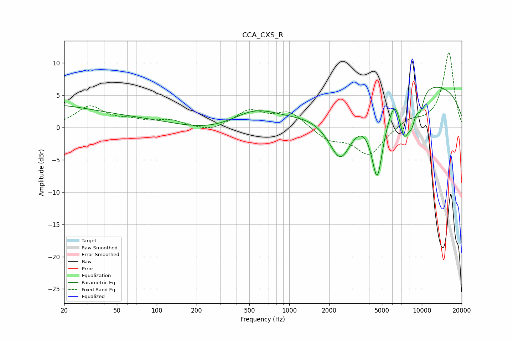

# CCA_CXS_R
See [usage instructions](https://github.com/jaakkopasanen/AutoEq#usage) for more options and info.

### Parametric EQs
Apply preamp of -6.3 dB when using parametric equalizer.

|   # | Type    |   Fc (Hz) |    Q |   Gain (dB) |
|-----|---------|-----------|------|-------------|
|   1 | Peaking |        40 | 0.18 |         5.7 |
|   2 | Peaking |       118 | 0.18 |        -4.1 |
|   3 | Peaking |       540 | 0.73 |         3.8 |
|   4 | Peaking |      2436 | 1.44 |        -8.7 |
|   5 | Peaking |      4611 | 2.88 |       -12.1 |
|   6 | Peaking |      6227 | 4.64 |         1.6 |
|   7 | Peaking |      7357 | 3.74 |        -5.5 |
|   8 | Peaking |      8377 | 3.84 |        -3.8 |
|   9 | Peaking |      8407 | 0.18 |         7.3 |
|  10 | Peaking |      9778 | 4.97 |        -2.4 |

### Fixed Band EQs
When using fixed band (also called graphic) equalizer, apply preamp of **-11.7 dB** (if available) and set gains manually with these parameters.

|   # | Type    |   Fc (Hz) |    Q |   Gain (dB) |
|-----|---------|-----------|------|-------------|
|   1 | Peaking |        31 | 1.41 |         3.2 |
|   2 | Peaking |        62 | 1.41 |         0.9 |
|   3 | Peaking |       125 | 1.41 |         1   |
|   4 | Peaking |       250 | 1.41 |        -0.8 |
|   5 | Peaking |       500 | 1.41 |         2.5 |
|   6 | Peaking |      1000 | 1.41 |         2.4 |
|   7 | Peaking |      2000 | 1.41 |        -1.8 |
|   8 | Peaking |      4000 | 1.41 |        -4.2 |
|   9 | Peaking |      8000 | 1.41 |         1.2 |
|  10 | Peaking |     16000 | 1.41 |        11.7 |

### Graphs

