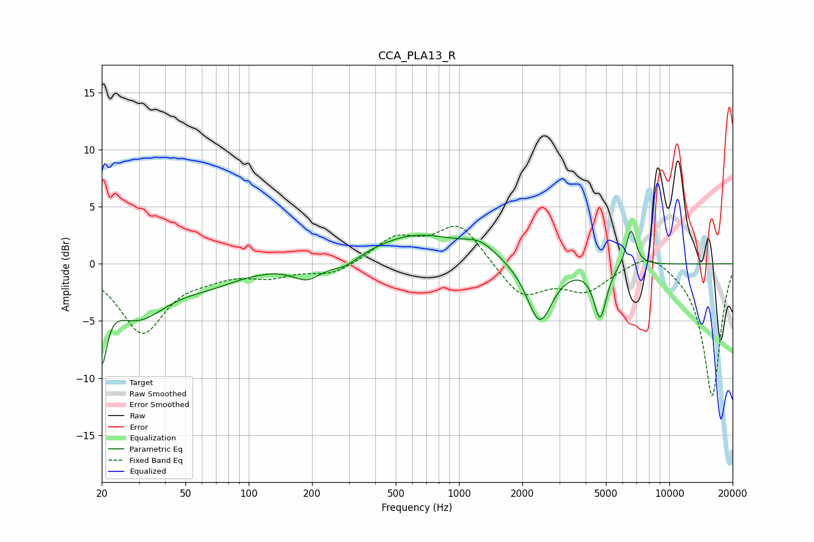

# CCA_PLA13_R
See [usage instructions](https://github.com/jaakkopasanen/AutoEq#usage) for more options and info.

### Parametric EQs
Apply preamp of -3.0 dB when using parametric equalizer.

|   # | Type    |   Fc (Hz) |    Q |   Gain (dB) |
|-----|---------|-----------|------|-------------|
|   1 | Peaking |        20 | 5.92 |        -5.9 |
|   2 | Peaking |        29 | 0.98 |        -4.4 |
|   3 | Peaking |        65 | 0.89 |        -1.2 |
|   4 | Peaking |       190 | 2.05 |        -1.4 |
|   5 | Peaking |       287 | 2.19 |        -0.8 |
|   6 | Peaking |       628 | 0.66 |         2.6 |
|   7 | Peaking |      1260 | 1.82 |         1.2 |
|   8 | Peaking |      2419 | 2.34 |        -5.3 |
|   9 | Peaking |      4689 | 4.72 |        -4.5 |
|  10 | Peaking |      6578 | 5.89 |         3.3 |

### Fixed Band EQs
When using fixed band (also called graphic) equalizer, apply preamp of **-3.4 dB** (if available) and set gains manually with these parameters.

|   # | Type    |   Fc (Hz) |    Q |   Gain (dB) |
|-----|---------|-----------|------|-------------|
|   1 | Peaking |        31 | 1.41 |        -5.9 |
|   2 | Peaking |        62 | 1.41 |        -0.7 |
|   3 | Peaking |       125 | 1.41 |        -0.9 |
|   4 | Peaking |       250 | 1.41 |        -1   |
|   5 | Peaking |       500 | 1.41 |         2.2 |
|   6 | Peaking |      1000 | 1.41 |         3.5 |
|   7 | Peaking |      2000 | 1.41 |        -2.9 |
|   8 | Peaking |      4000 | 1.41 |        -2.2 |
|   9 | Peaking |      8000 | 1.41 |         1.4 |
|  10 | Peaking |     16000 | 1.41 |       -11.7 |

### Graphs

