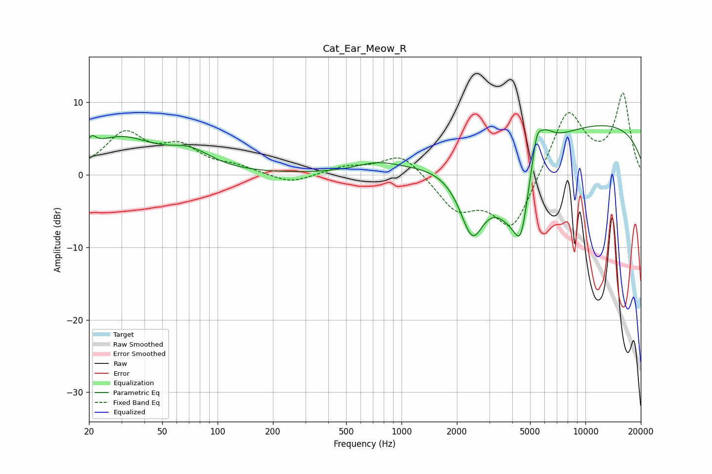

# Cat_Ear_Meow_R
See [usage instructions](https://github.com/jaakkopasanen/AutoEq#usage) for more options and info.

### Parametric EQs
Apply preamp of -6.9 dB when using parametric equalizer.

|   # | Type    |   Fc (Hz) |    Q |   Gain (dB) |
|-----|---------|-----------|------|-------------|
|   1 | Peaking |        21 | 5.89 |         1.5 |
|   2 | Peaking |        29 | 0.75 |         4.9 |
|   3 | Peaking |        71 | 1.23 |         2.3 |
|   4 | Peaking |       738 | 1.25 |         1.2 |
|   5 | Peaking |      2423 | 1.97 |        -9.3 |
|   6 | Peaking |      4049 | 1.18 |       -10.1 |
|   7 | Peaking |      4464 | 3.98 |        -5.7 |
|   8 | Peaking |      5419 | 5.5  |         3.5 |
|   9 | Peaking |      5918 | 2.44 |         3.7 |
|  10 | Peaking |      9124 | 0.18 |         7.5 |

### Fixed Band EQs
When using fixed band (also called graphic) equalizer, apply preamp of **-11.4 dB** (if available) and set gains manually with these parameters.

|   # | Type    |   Fc (Hz) |    Q |   Gain (dB) |
|-----|---------|-----------|------|-------------|
|   1 | Peaking |        31 | 1.41 |         5.4 |
|   2 | Peaking |        62 | 1.41 |         3.4 |
|   3 | Peaking |       125 | 1.41 |         0.9 |
|   4 | Peaking |       250 | 1.41 |        -1.3 |
|   5 | Peaking |       500 | 1.41 |         1   |
|   6 | Peaking |      1000 | 1.41 |         3.1 |
|   7 | Peaking |      2000 | 1.41 |        -4.5 |
|   8 | Peaking |      4000 | 1.41 |        -7.8 |
|   9 | Peaking |      8000 | 1.41 |         9.1 |
|  10 | Peaking |     16000 | 1.41 |        10.9 |

### Graphs

