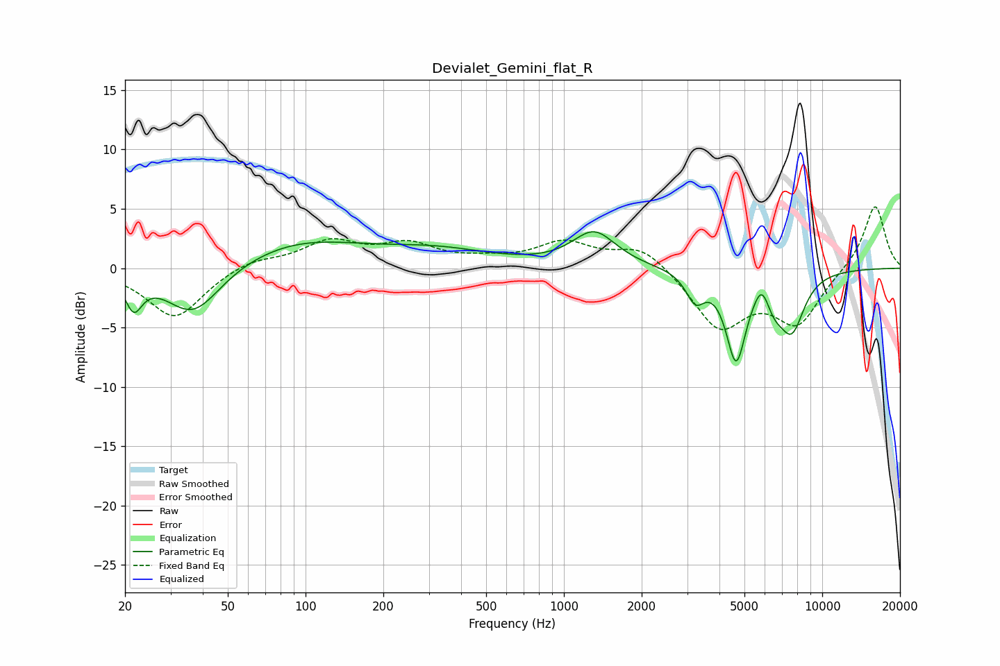

# Devialet_Gemini_flat_R
See [usage instructions](https://github.com/jaakkopasanen/AutoEq#usage) for more options and info.

### Parametric EQs
Apply preamp of -3.2 dB when using parametric equalizer.

|   # | Type    |   Fc (Hz) |    Q |   Gain (dB) |
|-----|---------|-----------|------|-------------|
|   1 | Peaking |        22 | 4.4  |        -2.7 |
|   2 | Peaking |        37 | 1.32 |        -4.3 |
|   3 | Peaking |        95 | 0.57 |         2.2 |
|   4 | Peaking |       325 | 0.65 |         1.3 |
|   5 | Peaking |      1310 | 1.69 |         2.9 |
|   6 | Peaking |      3227 | 3.91 |        -2.3 |
|   7 | Peaking |      4639 | 3.62 |        -7.3 |
|   8 | Peaking |      5845 | 4.52 |         2   |
|   9 | Peaking |      6472 | 3.04 |        -2.1 |
|  10 | Peaking |      7641 | 2.72 |        -4.5 |

### Fixed Band EQs
When using fixed band (also called graphic) equalizer, apply preamp of **-5.3 dB** (if available) and set gains manually with these parameters.

|   # | Type    |   Fc (Hz) |    Q |   Gain (dB) |
|-----|---------|-----------|------|-------------|
|   1 | Peaking |        31 | 1.41 |        -4.2 |
|   2 | Peaking |        62 | 1.41 |         0.8 |
|   3 | Peaking |       125 | 1.41 |         2.1 |
|   4 | Peaking |       250 | 1.41 |         1.8 |
|   5 | Peaking |       500 | 1.41 |         0.5 |
|   6 | Peaking |      1000 | 1.41 |         2   |
|   7 | Peaking |      2000 | 1.41 |         2   |
|   8 | Peaking |      4000 | 1.41 |        -4.9 |
|   9 | Peaking |      8000 | 1.41 |        -4.4 |
|  10 | Peaking |     16000 | 1.41 |         5.5 |

### Graphs

