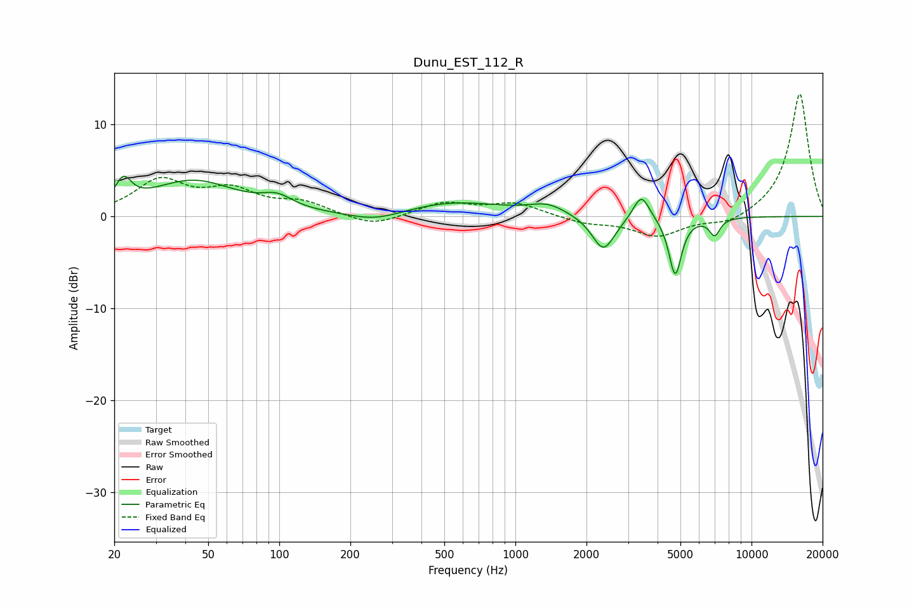

# Dunu_EST_112_R
See [usage instructions](https://github.com/jaakkopasanen/AutoEq#usage) for more options and info.

### Parametric EQs
Apply preamp of -4.5 dB when using parametric equalizer.

|   # | Type    |   Fc (Hz) |    Q |   Gain (dB) |
|-----|---------|-----------|------|-------------|
|   1 | Peaking |        22 | 4.27 |         2.7 |
|   2 | Peaking |        43 | 0.76 |         3.8 |
|   3 | Peaking |        98 | 2.21 |         1.2 |
|   4 | Peaking |       256 | 1.25 |        -1   |
|   5 | Peaking |       550 | 0.66 |         1.5 |
|   6 | Peaking |      1368 | 1.83 |         1.1 |
|   7 | Peaking |      2359 | 2.92 |        -3.9 |
|   8 | Peaking |      3417 | 4.12 |         2.8 |
|   9 | Peaking |      4751 | 5.22 |        -6.4 |
|  10 | Peaking |      6980 | 6    |        -1.9 |

### Fixed Band EQs
When using fixed band (also called graphic) equalizer, apply preamp of **-13.4 dB** (if available) and set gains manually with these parameters.

|   # | Type    |   Fc (Hz) |    Q |   Gain (dB) |
|-----|---------|-----------|------|-------------|
|   1 | Peaking |        31 | 1.41 |         3.7 |
|   2 | Peaking |        62 | 1.41 |         2.5 |
|   3 | Peaking |       125 | 1.41 |         1.4 |
|   4 | Peaking |       250 | 1.41 |        -1.2 |
|   5 | Peaking |       500 | 1.41 |         1.5 |
|   6 | Peaking |      1000 | 1.41 |         1.4 |
|   7 | Peaking |      2000 | 1.41 |        -0.7 |
|   8 | Peaking |      4000 | 1.41 |        -2.1 |
|   9 | Peaking |      8000 | 1.41 |        -1   |
|  10 | Peaking |     16000 | 1.41 |        13.5 |

### Graphs

