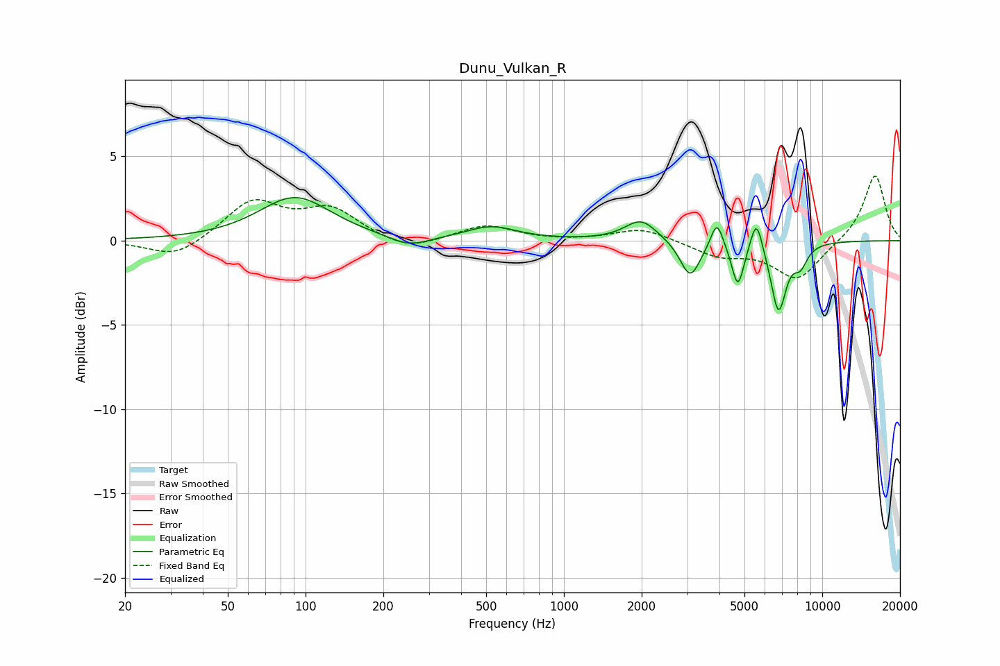

# Dunu_Vulkan_R
See [usage instructions](https://github.com/jaakkopasanen/AutoEq#usage) for more options and info.

### Parametric EQs
Apply preamp of -2.6 dB when using parametric equalizer.

|   # | Type    |   Fc (Hz) |    Q |   Gain (dB) |
|-----|---------|-----------|------|-------------|
|   1 | Peaking |        91 | 1.03 |         2.6 |
|   2 | Peaking |       252 | 1.84 |        -0.6 |
|   3 | Peaking |       523 | 1.46 |         0.8 |
|   4 | Peaking |      1989 | 2.28 |         1.3 |
|   5 | Peaking |      3083 | 3.63 |        -2.2 |
|   6 | Peaking |      3912 | 6    |         1.6 |
|   7 | Peaking |      4715 | 5.95 |        -2.6 |
|   8 | Peaking |      5566 | 6    |         2   |
|   9 | Peaking |      6773 | 4.55 |        -4.1 |
|  10 | Peaking |      8232 | 4.82 |        -1.1 |

### Fixed Band EQs
When using fixed band (also called graphic) equalizer, apply preamp of **-3.9 dB** (if available) and set gains manually with these parameters.

|   # | Type    |   Fc (Hz) |    Q |   Gain (dB) |
|-----|---------|-----------|------|-------------|
|   1 | Peaking |        31 | 1.41 |        -1.1 |
|   2 | Peaking |        62 | 1.41 |         2.3 |
|   3 | Peaking |       125 | 1.41 |         1.8 |
|   4 | Peaking |       250 | 1.41 |        -0.7 |
|   5 | Peaking |       500 | 1.41 |         0.9 |
|   6 | Peaking |      1000 | 1.41 |        -0   |
|   7 | Peaking |      2000 | 1.41 |         0.8 |
|   8 | Peaking |      4000 | 1.41 |        -0.8 |
|   9 | Peaking |      8000 | 1.41 |        -2.3 |
|  10 | Peaking |     16000 | 1.41 |         4   |

### Graphs

