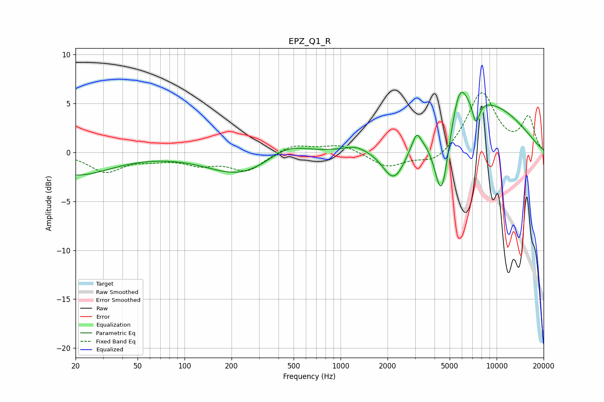

# EPZ_Q1_R
See [usage instructions](https://github.com/jaakkopasanen/AutoEq#usage) for more options and info.

### Parametric EQs
Apply preamp of -6.2 dB when using parametric equalizer.

|   # | Type    |   Fc (Hz) |    Q |   Gain (dB) |
|-----|---------|-----------|------|-------------|
|   1 | Peaking |        20 | 0.62 |        -2.3 |
|   2 | Peaking |       226 | 0.68 |        -2.3 |
|   3 | Peaking |       456 | 1.15 |         1.3 |
|   4 | Peaking |      1239 | 2.24 |         0.4 |
|   5 | Peaking |      2208 | 1.8  |        -4.4 |
|   6 | Peaking |      3070 | 5.35 |         1.5 |
|   7 | Peaking |      4436 | 2.8  |        -8.5 |
|   8 | Peaking |      5780 | 2.84 |         3.4 |
|   9 | Peaking |      7141 | 0.37 |         5.5 |
|  10 | Peaking |      7371 | 5.7  |        -2.4 |

### Fixed Band EQs
When using fixed band (also called graphic) equalizer, apply preamp of **-6.2 dB** (if available) and set gains manually with these parameters.

|   # | Type    |   Fc (Hz) |    Q |   Gain (dB) |
|-----|---------|-----------|------|-------------|
|   1 | Peaking |        31 | 1.41 |        -1.9 |
|   2 | Peaking |        62 | 1.41 |        -0.5 |
|   3 | Peaking |       125 | 1.41 |        -1.1 |
|   4 | Peaking |       250 | 1.41 |        -1.8 |
|   5 | Peaking |       500 | 1.41 |         0.9 |
|   6 | Peaking |      1000 | 1.41 |         0.8 |
|   7 | Peaking |      2000 | 1.41 |        -1.5 |
|   8 | Peaking |      4000 | 1.41 |        -1.2 |
|   9 | Peaking |      8000 | 1.41 |         6.1 |
|  10 | Peaking |     16000 | 1.41 |         3.5 |

### Graphs

