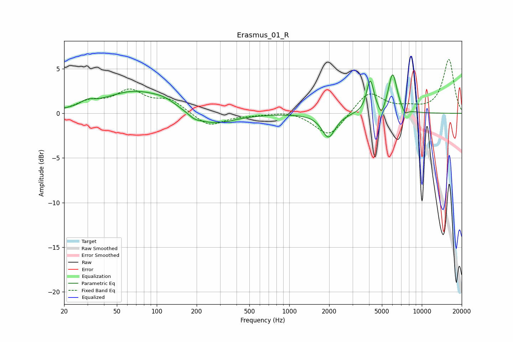

# Erasmus_01_R
See [usage instructions](https://github.com/jaakkopasanen/AutoEq#usage) for more options and info.

### Parametric EQs
Apply preamp of -4.4 dB when using parametric equalizer.

|   # | Type    |   Fc (Hz) |    Q |   Gain (dB) |
|-----|---------|-----------|------|-------------|
|   1 | Peaking |        30 | 3    |         0.5 |
|   2 | Peaking |        69 | 0.61 |         2.5 |
|   3 | Peaking |       115 | 1.75 |         0.5 |
|   4 | Peaking |       192 | 3.27 |        -0.4 |
|   5 | Peaking |       260 | 0.89 |        -1.4 |
|   6 | Peaking |      1976 | 2.82 |        -2.7 |
|   7 | Peaking |      4083 | 5.22 |         3.6 |
|   8 | Peaking |      4969 | 6    |        -1.2 |
|   9 | Peaking |      6028 | 4.29 |         4.4 |
|  10 | Peaking |      7454 | 6    |        -0.7 |

### Fixed Band EQs
When using fixed band (also called graphic) equalizer, apply preamp of **-6.1 dB** (if available) and set gains manually with these parameters.

|   # | Type    |   Fc (Hz) |    Q |   Gain (dB) |
|-----|---------|-----------|------|-------------|
|   1 | Peaking |        31 | 1.41 |         1.1 |
|   2 | Peaking |        62 | 1.41 |         2.3 |
|   3 | Peaking |       125 | 1.41 |         1.4 |
|   4 | Peaking |       250 | 1.41 |        -1.5 |
|   5 | Peaking |       500 | 1.41 |        -0.1 |
|   6 | Peaking |      1000 | 1.41 |         0.3 |
|   7 | Peaking |      2000 | 1.41 |        -2.7 |
|   8 | Peaking |      4000 | 1.41 |         2.5 |
|   9 | Peaking |      8000 | 1.41 |         0.5 |
|  10 | Peaking |     16000 | 1.41 |         6   |

### Graphs

