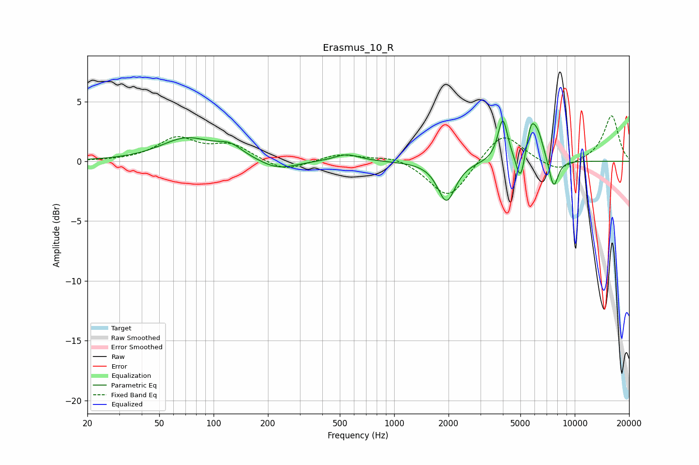

# Erasmus_10_R
See [usage instructions](https://github.com/jaakkopasanen/AutoEq#usage) for more options and info.

### Parametric EQs
Apply preamp of -3.5 dB when using parametric equalizer.

|   # | Type    |   Fc (Hz) |    Q |   Gain (dB) |
|-----|---------|-----------|------|-------------|
|   1 | Peaking |        71 | 0.99 |         1.9 |
|   2 | Peaking |       123 | 1.97 |         0.9 |
|   3 | Peaking |       227 | 1.39 |        -0.8 |
|   4 | Peaking |       546 | 1.98 |         0.6 |
|   5 | Peaking |      1949 | 2.93 |        -3.3 |
|   6 | Peaking |      3994 | 5.21 |         3.6 |
|   7 | Peaking |      5004 | 5.99 |        -2.4 |
|   8 | Peaking |      5714 | 5.76 |         2.1 |
|   9 | Peaking |      6224 | 3.88 |         2.3 |
|  10 | Peaking |      7640 | 5.18 |        -2.5 |

### Fixed Band EQs
When using fixed band (also called graphic) equalizer, apply preamp of **-3.9 dB** (if available) and set gains manually with these parameters.

|   # | Type    |   Fc (Hz) |    Q |   Gain (dB) |
|-----|---------|-----------|------|-------------|
|   1 | Peaking |        31 | 1.41 |         0   |
|   2 | Peaking |        62 | 1.41 |         1.8 |
|   3 | Peaking |       125 | 1.41 |         1.3 |
|   4 | Peaking |       250 | 1.41 |        -0.9 |
|   5 | Peaking |       500 | 1.41 |         0.6 |
|   6 | Peaking |      1000 | 1.41 |         0.5 |
|   7 | Peaking |      2000 | 1.41 |        -3.2 |
|   8 | Peaking |      4000 | 1.41 |         2.6 |
|   9 | Peaking |      8000 | 1.41 |        -1   |
|  10 | Peaking |     16000 | 1.41 |         3.8 |

### Graphs

