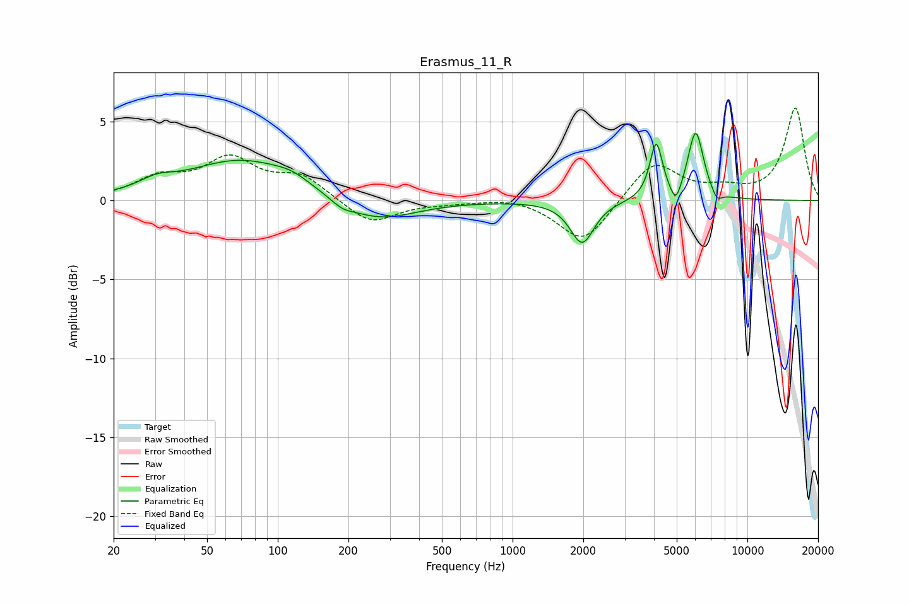

# Erasmus_11_R
See [usage instructions](https://github.com/jaakkopasanen/AutoEq#usage) for more options and info.

### Parametric EQs
Apply preamp of -4.3 dB when using parametric equalizer.

|   # | Type    |   Fc (Hz) |    Q |   Gain (dB) |
|-----|---------|-----------|------|-------------|
|   1 | Peaking |        30 | 1.92 |         0.6 |
|   2 | Peaking |        70 | 0.62 |         2.5 |
|   3 | Peaking |       115 | 1.83 |         0.5 |
|   4 | Peaking |       188 | 2.99 |        -0.4 |
|   5 | Peaking |       265 | 0.89 |        -1.4 |
|   6 | Peaking |      1979 | 2.82 |        -2.7 |
|   7 | Peaking |      4089 | 5.31 |         3.6 |
|   8 | Peaking |      4957 | 6    |        -1.2 |
|   9 | Peaking |      6022 | 4.15 |         4.4 |
|  10 | Peaking |      7408 | 6    |        -0.7 |

### Fixed Band EQs
When using fixed band (also called graphic) equalizer, apply preamp of **-5.9 dB** (if available) and set gains manually with these parameters.

|   # | Type    |   Fc (Hz) |    Q |   Gain (dB) |
|-----|---------|-----------|------|-------------|
|   1 | Peaking |        31 | 1.41 |         1.3 |
|   2 | Peaking |        62 | 1.41 |         2.4 |
|   3 | Peaking |       125 | 1.41 |         1.4 |
|   4 | Peaking |       250 | 1.41 |        -1.5 |
|   5 | Peaking |       500 | 1.41 |        -0.1 |
|   6 | Peaking |      1000 | 1.41 |         0.3 |
|   7 | Peaking |      2000 | 1.41 |        -2.8 |
|   8 | Peaking |      4000 | 1.41 |         2.5 |
|   9 | Peaking |      8000 | 1.41 |         0.6 |
|  10 | Peaking |     16000 | 1.41 |         5.8 |

### Graphs

