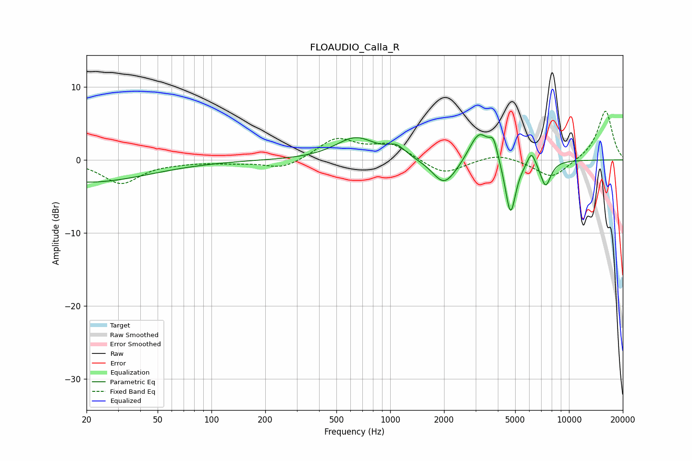

# FLOAUDIO_Calla_R
See [usage instructions](https://github.com/jaakkopasanen/AutoEq#usage) for more options and info.

### Parametric EQs
Apply preamp of -3.6 dB when using parametric equalizer.

|   # | Type    |   Fc (Hz) |    Q |   Gain (dB) |
|-----|---------|-----------|------|-------------|
|   1 | Peaking |        20 | 0.41 |        -3.1 |
|   2 | Peaking |       641 | 1.26 |         3   |
|   3 | Peaking |      1086 | 2.83 |         1.4 |
|   4 | Peaking |      1989 | 2.2  |        -3.2 |
|   5 | Peaking |      2290 | 1.82 |        -0.7 |
|   6 | Peaking |      3143 | 2.49 |         4.3 |
|   7 | Peaking |      3784 | 5.95 |         2.4 |
|   8 | Peaking |      4710 | 4.68 |        -7.8 |
|   9 | Peaking |      6169 | 5.95 |         2   |
|  10 | Peaking |      7403 | 4.6  |        -3.5 |

### Fixed Band EQs
When using fixed band (also called graphic) equalizer, apply preamp of **-6.8 dB** (if available) and set gains manually with these parameters.

|   # | Type    |   Fc (Hz) |    Q |   Gain (dB) |
|-----|---------|-----------|------|-------------|
|   1 | Peaking |        31 | 1.41 |        -3.2 |
|   2 | Peaking |        62 | 1.41 |        -0.2 |
|   3 | Peaking |       125 | 1.41 |        -0.3 |
|   4 | Peaking |       250 | 1.41 |        -1.3 |
|   5 | Peaking |       500 | 1.41 |         2.9 |
|   6 | Peaking |      1000 | 1.41 |         2.1 |
|   7 | Peaking |      2000 | 1.41 |        -2.1 |
|   8 | Peaking |      4000 | 1.41 |         1   |
|   9 | Peaking |      8000 | 1.41 |        -2.6 |
|  10 | Peaking |     16000 | 1.41 |         6.8 |

### Graphs

