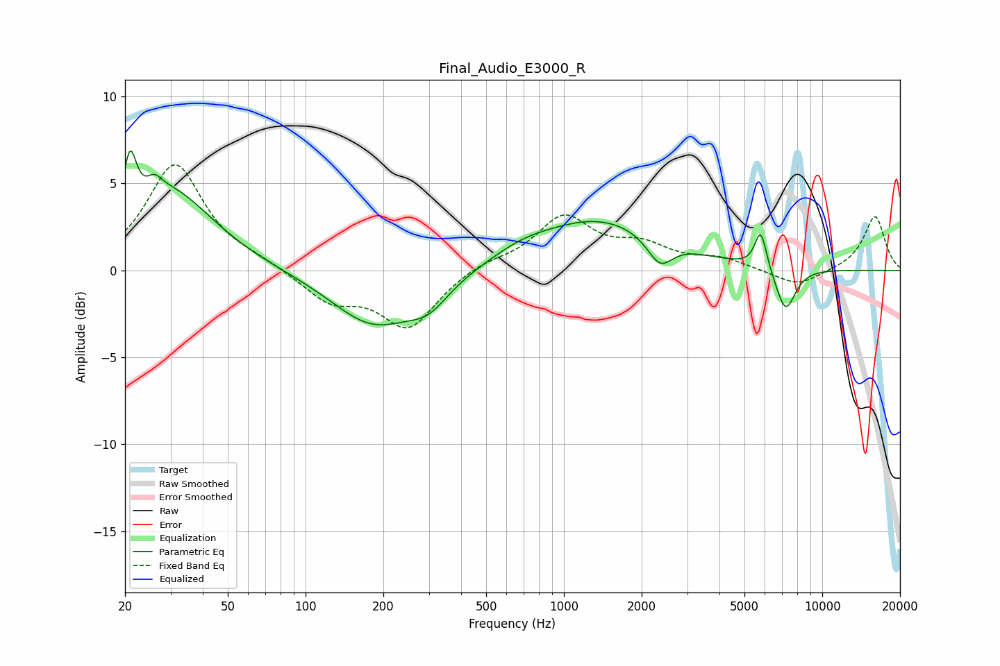

# Final_Audio_E3000_R
See [usage instructions](https://github.com/jaakkopasanen/AutoEq#usage) for more options and info.

### Parametric EQs
Apply preamp of -7.0 dB when using parametric equalizer.

|   # | Type    |   Fc (Hz) |    Q |   Gain (dB) |
|-----|---------|-----------|------|-------------|
|   1 | Peaking |        21 | 5.89 |         3.3 |
|   2 | Peaking |        26 | 5.04 |         0.7 |
|   3 | Peaking |        29 | 0.82 |         4.6 |
|   4 | Peaking |       184 | 0.85 |        -3.2 |
|   5 | Peaking |       300 | 1.79 |        -1.3 |
|   6 | Peaking |       682 | 1.24 |         0.5 |
|   7 | Peaking |      1371 | 0.56 |         2.9 |
|   8 | Peaking |      2354 | 2.87 |        -1.6 |
|   9 | Peaking |      5781 | 6    |         2.2 |
|  10 | Peaking |      7212 | 3.49 |        -2.5 |

### Fixed Band EQs
When using fixed band (also called graphic) equalizer, apply preamp of **-6.2 dB** (if available) and set gains manually with these parameters.

|   # | Type    |   Fc (Hz) |    Q |   Gain (dB) |
|-----|---------|-----------|------|-------------|
|   1 | Peaking |        31 | 1.41 |         6.1 |
|   2 | Peaking |        62 | 1.41 |         0.4 |
|   3 | Peaking |       125 | 1.41 |        -1.7 |
|   4 | Peaking |       250 | 1.41 |        -3.2 |
|   5 | Peaking |       500 | 1.41 |         0.5 |
|   6 | Peaking |      1000 | 1.41 |         3   |
|   7 | Peaking |      2000 | 1.41 |         1.2 |
|   8 | Peaking |      4000 | 1.41 |         0.6 |
|   9 | Peaking |      8000 | 1.41 |        -1   |
|  10 | Peaking |     16000 | 1.41 |         3.1 |

### Graphs

