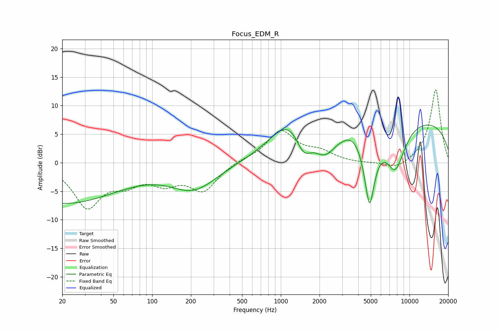

# Focus_EDM_R
See [usage instructions](https://github.com/jaakkopasanen/AutoEq#usage) for more options and info.

### Parametric EQs
Apply preamp of -6.7 dB when using parametric equalizer.

|   # | Type    |   Fc (Hz) |    Q |   Gain (dB) |
|-----|---------|-----------|------|-------------|
|   1 | Peaking |        20 | 0.31 |        -7.1 |
|   2 | Peaking |       211 | 0.79 |        -4.5 |
|   3 | Peaking |      1168 | 0.94 |         6.2 |
|   4 | Peaking |      1502 | 2.27 |        -4.3 |
|   5 | Peaking |      2202 | 1.65 |        -3.9 |
|   6 | Peaking |      3666 | 2.23 |         1.1 |
|   7 | Peaking |      4892 | 3.21 |       -12.8 |
|   8 | Peaking |      7773 | 1.74 |        -7.9 |
|   9 | Peaking |      9140 | 0.18 |         7.9 |
|  10 | Peaking |      9891 | 6    |        -0.1 |

### Fixed Band EQs
When using fixed band (also called graphic) equalizer, apply preamp of **-12.9 dB** (if available) and set gains manually with these parameters.

|   # | Type    |   Fc (Hz) |    Q |   Gain (dB) |
|-----|---------|-----------|------|-------------|
|   1 | Peaking |        31 | 1.41 |        -7.5 |
|   2 | Peaking |        62 | 1.41 |        -2.8 |
|   3 | Peaking |       125 | 1.41 |        -2.9 |
|   4 | Peaking |       250 | 1.41 |        -4.7 |
|   5 | Peaking |       500 | 1.41 |         0.5 |
|   6 | Peaking |      1000 | 1.41 |         5.5 |
|   7 | Peaking |      2000 | 1.41 |         1.6 |
|   8 | Peaking |      4000 | 1.41 |        -0.2 |
|   9 | Peaking |      8000 | 1.41 |        -1.3 |
|  10 | Peaking |     16000 | 1.41 |        12.9 |

### Graphs

