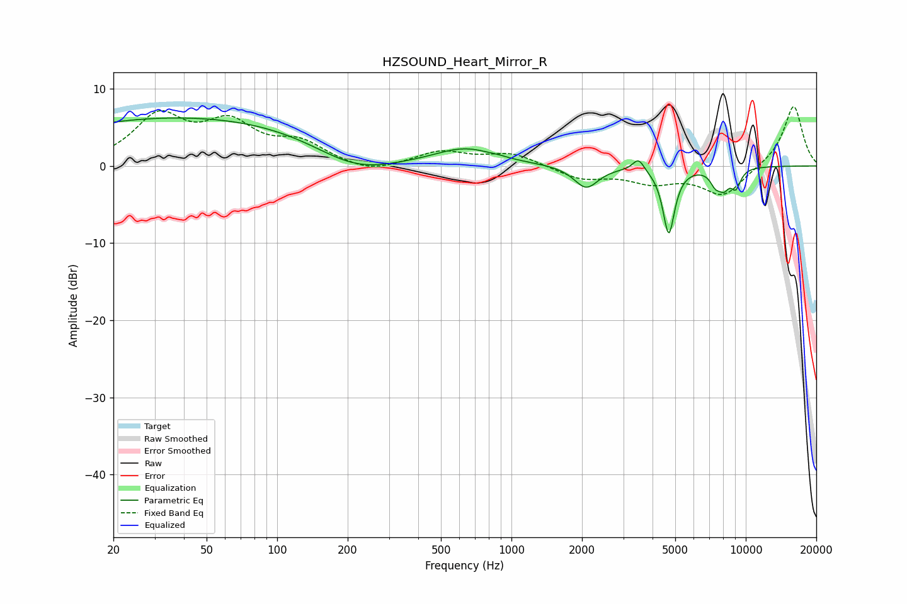

# HZSOUND_Heart_Mirror_R
See [usage instructions](https://github.com/jaakkopasanen/AutoEq#usage) for more options and info.

### Parametric EQs
Apply preamp of -6.3 dB when using parametric equalizer.

|   # | Type    |   Fc (Hz) |    Q |   Gain (dB) |
|-----|---------|-----------|------|-------------|
|   1 | Peaking |        42 | 0.2  |         6.4 |
|   2 | Peaking |       214 | 0.79 |        -3.1 |
|   3 | Peaking |       636 | 1.08 |         2.2 |
|   4 | Peaking |       881 | 5.73 |         0.1 |
|   5 | Peaking |      2085 | 2.74 |        -2.9 |
|   6 | Peaking |      3484 | 5.88 |         1.6 |
|   7 | Peaking |      4693 | 5.59 |        -8.7 |
|   8 | Peaking |      7431 | 5.8  |        -1.8 |
|   9 | Peaking |      8073 | 5.76 |        -2   |
|  10 | Peaking |      9066 | 6    |        -2.4 |

### Fixed Band EQs
When using fixed band (also called graphic) equalizer, apply preamp of **-7.8 dB** (if available) and set gains manually with these parameters.

|   # | Type    |   Fc (Hz) |    Q |   Gain (dB) |
|-----|---------|-----------|------|-------------|
|   1 | Peaking |        31 | 1.41 |         6.1 |
|   2 | Peaking |        62 | 1.41 |         4.9 |
|   3 | Peaking |       125 | 1.41 |         2.6 |
|   4 | Peaking |       250 | 1.41 |        -1.1 |
|   5 | Peaking |       500 | 1.41 |         1.8 |
|   6 | Peaking |      1000 | 1.41 |         1.6 |
|   7 | Peaking |      2000 | 1.41 |        -1.6 |
|   8 | Peaking |      4000 | 1.41 |        -1.9 |
|   9 | Peaking |      8000 | 1.41 |        -3.8 |
|  10 | Peaking |     16000 | 1.41 |         7.9 |

### Graphs

