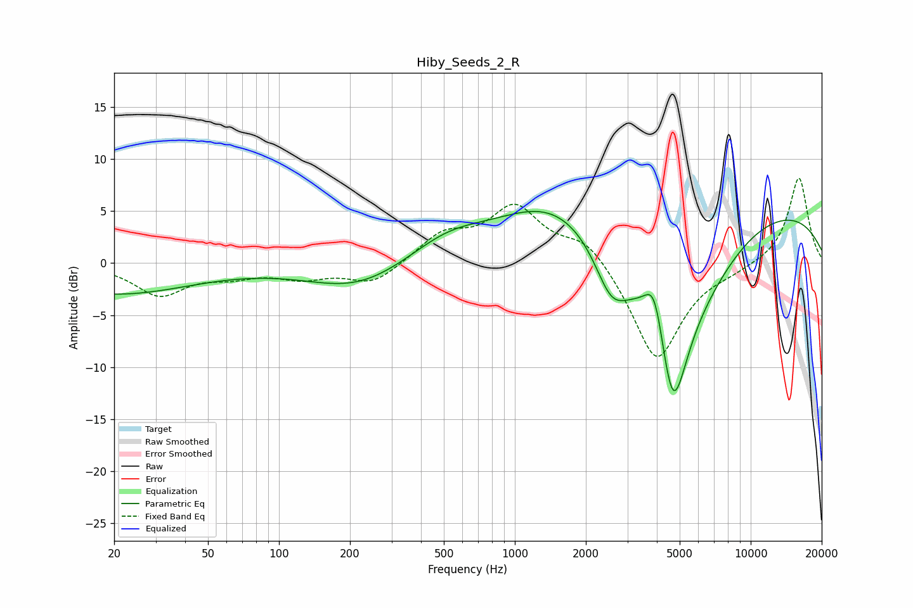

# Hiby_Seeds_2_R
See [usage instructions](https://github.com/jaakkopasanen/AutoEq#usage) for more options and info.

### Parametric EQs
Apply preamp of -5.1 dB when using parametric equalizer.

|   # | Type    |   Fc (Hz) |    Q |   Gain (dB) |
|-----|---------|-----------|------|-------------|
|   1 | Peaking |        20 | 0.42 |        -2.9 |
|   2 | Peaking |       216 | 0.66 |        -2.5 |
|   3 | Peaking |       518 | 0.84 |         2.3 |
|   4 | Peaking |      1376 | 0.63 |         3.9 |
|   5 | Peaking |      2563 | 1.9  |        -5   |
|   6 | Peaking |      3101 | 2.21 |        -0.4 |
|   7 | Peaking |      3918 | 3.32 |         5.2 |
|   8 | Peaking |      4670 | 1.46 |       -18.6 |
|   9 | Peaking |      6716 | 0.86 |        -2   |
|  10 | Peaking |      7871 | 0.18 |         6   |

### Fixed Band EQs
When using fixed band (also called graphic) equalizer, apply preamp of **-8.2 dB** (if available) and set gains manually with these parameters.

|   # | Type    |   Fc (Hz) |    Q |   Gain (dB) |
|-----|---------|-----------|------|-------------|
|   1 | Peaking |        31 | 1.41 |        -3   |
|   2 | Peaking |        62 | 1.41 |        -1   |
|   3 | Peaking |       125 | 1.41 |        -1.2 |
|   4 | Peaking |       250 | 1.41 |        -2   |
|   5 | Peaking |       500 | 1.41 |         2.6 |
|   6 | Peaking |      1000 | 1.41 |         5.2 |
|   7 | Peaking |      2000 | 1.41 |         2.5 |
|   8 | Peaking |      4000 | 1.41 |        -9.6 |
|   9 | Peaking |      8000 | 1.41 |        -0.5 |
|  10 | Peaking |     16000 | 1.41 |         8.3 |

### Graphs

