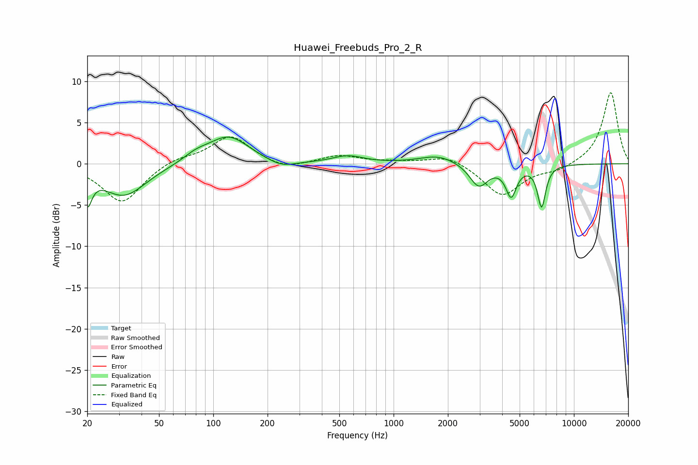

# Huawei_Freebuds_Pro_2_R
See [usage instructions](https://github.com/jaakkopasanen/AutoEq#usage) for more options and info.

### Parametric EQs
Apply preamp of -3.3 dB when using parametric equalizer.

|   # | Type    |   Fc (Hz) |    Q |   Gain (dB) |
|-----|---------|-----------|------|-------------|
|   1 | Peaking |        20 | 5.83 |        -3.6 |
|   2 | Peaking |        32 | 1.15 |        -3.9 |
|   3 | Peaking |        80 | 2.06 |         0.8 |
|   4 | Peaking |       121 | 1.23 |         3.4 |
|   5 | Peaking |       239 | 1.79 |        -0.9 |
|   6 | Peaking |       558 | 1.66 |         0.9 |
|   7 | Peaking |      1770 | 1.37 |         1   |
|   8 | Peaking |      2968 | 2.77 |        -2.8 |
|   9 | Peaking |      4487 | 4.73 |        -3.6 |
|  10 | Peaking |      6619 | 6    |        -5   |

### Fixed Band EQs
When using fixed band (also called graphic) equalizer, apply preamp of **-8.7 dB** (if available) and set gains manually with these parameters.

|   # | Type    |   Fc (Hz) |    Q |   Gain (dB) |
|-----|---------|-----------|------|-------------|
|   1 | Peaking |        31 | 1.41 |        -4.8 |
|   2 | Peaking |        62 | 1.41 |         0.8 |
|   3 | Peaking |       125 | 1.41 |         3.4 |
|   4 | Peaking |       250 | 1.41 |        -0.8 |
|   5 | Peaking |       500 | 1.41 |         1   |
|   6 | Peaking |      1000 | 1.41 |         0.2 |
|   7 | Peaking |      2000 | 1.41 |         1.1 |
|   8 | Peaking |      4000 | 1.41 |        -3.9 |
|   9 | Peaking |      8000 | 1.41 |        -0.8 |
|  10 | Peaking |     16000 | 1.41 |         8.7 |

### Graphs

