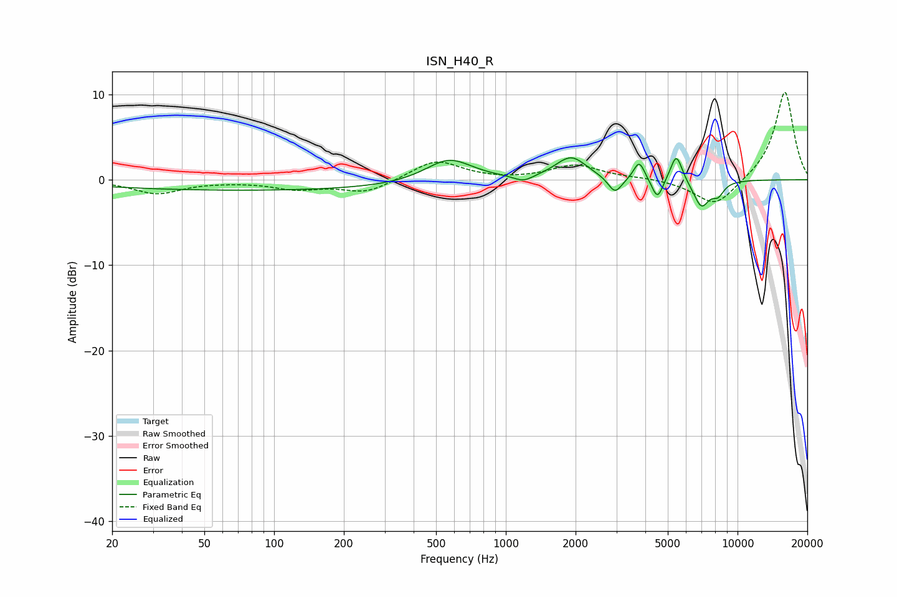

# ISN_H40_R
See [usage instructions](https://github.com/jaakkopasanen/AutoEq#usage) for more options and info.

### Parametric EQs
Apply preamp of -2.7 dB when using parametric equalizer.

|   # | Type    |   Fc (Hz) |    Q |   Gain (dB) |
|-----|---------|-----------|------|-------------|
|   1 | Peaking |        83 | 0.18 |        -1.2 |
|   2 | Peaking |       568 | 1.41 |         2.7 |
|   3 | Peaking |      1191 | 3.37 |        -0.8 |
|   4 | Peaking |      1913 | 2.12 |         2.6 |
|   5 | Peaking |      2961 | 4.7  |        -1.9 |
|   6 | Peaking |      3764 | 5.97 |         2.2 |
|   7 | Peaking |      4512 | 5.94 |        -2.5 |
|   8 | Peaking |      5444 | 5.51 |         3.3 |
|   9 | Peaking |      6982 | 3.96 |        -3.1 |
|  10 | Peaking |      8239 | 5.1  |        -1.4 |

### Fixed Band EQs
When using fixed band (also called graphic) equalizer, apply preamp of **-10.3 dB** (if available) and set gains manually with these parameters.

|   # | Type    |   Fc (Hz) |    Q |   Gain (dB) |
|-----|---------|-----------|------|-------------|
|   1 | Peaking |        31 | 1.41 |        -1.6 |
|   2 | Peaking |        62 | 1.41 |        -0.1 |
|   3 | Peaking |       125 | 1.41 |        -1   |
|   4 | Peaking |       250 | 1.41 |        -1.5 |
|   5 | Peaking |       500 | 1.41 |         2.3 |
|   6 | Peaking |      1000 | 1.41 |        -0.1 |
|   7 | Peaking |      2000 | 1.41 |         1.7 |
|   8 | Peaking |      4000 | 1.41 |         0.2 |
|   9 | Peaking |      8000 | 1.41 |        -3.2 |
|  10 | Peaking |     16000 | 1.41 |        10.4 |

### Graphs

