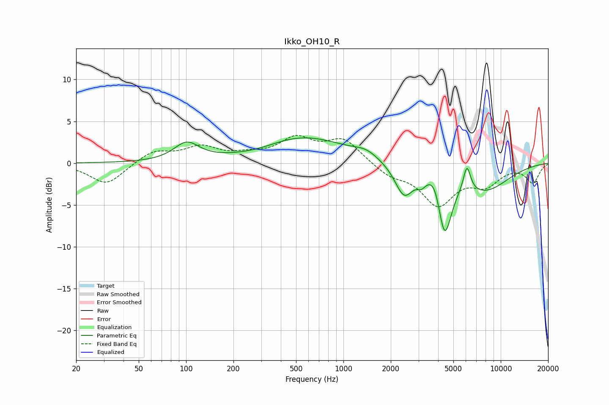

# Ikko_OH10_R
See [usage instructions](https://github.com/jaakkopasanen/AutoEq#usage) for more options and info.

### Parametric EQs
Apply preamp of -3.1 dB when using parametric equalizer.

|   # | Type    |   Fc (Hz) |    Q |   Gain (dB) |
|-----|---------|-----------|------|-------------|
|   1 | Peaking |       101 | 1.78 |         2.2 |
|   2 | Peaking |       294 | 0.95 |        -0.5 |
|   3 | Peaking |       543 | 0.51 |         3.2 |
|   4 | Peaking |      1391 | 1.89 |         0.8 |
|   5 | Peaking |      2428 | 2.41 |        -3.7 |
|   6 | Peaking |      3130 | 5.3  |        -0.9 |
|   7 | Peaking |      3846 | 3.19 |         2.3 |
|   8 | Peaking |      4385 | 3.05 |        -7.9 |
|   9 | Peaking |      6095 | 5.97 |         3.1 |
|  10 | Peaking |      7874 | 0.81 |        -3.1 |

### Fixed Band EQs
When using fixed band (also called graphic) equalizer, apply preamp of **-3.4 dB** (if available) and set gains manually with these parameters.

|   # | Type    |   Fc (Hz) |    Q |   Gain (dB) |
|-----|---------|-----------|------|-------------|
|   1 | Peaking |        31 | 1.41 |        -2.6 |
|   2 | Peaking |        62 | 1.41 |         1.4 |
|   3 | Peaking |       125 | 1.41 |         1.8 |
|   4 | Peaking |       250 | 1.41 |         0.7 |
|   5 | Peaking |       500 | 1.41 |         2.7 |
|   6 | Peaking |      1000 | 1.41 |         2.7 |
|   7 | Peaking |      2000 | 1.41 |        -1.3 |
|   8 | Peaking |      4000 | 1.41 |        -4.8 |
|   9 | Peaking |      8000 | 1.41 |        -2.3 |
|  10 | Peaking |     16000 | 1.41 |        -2.3 |

### Graphs

