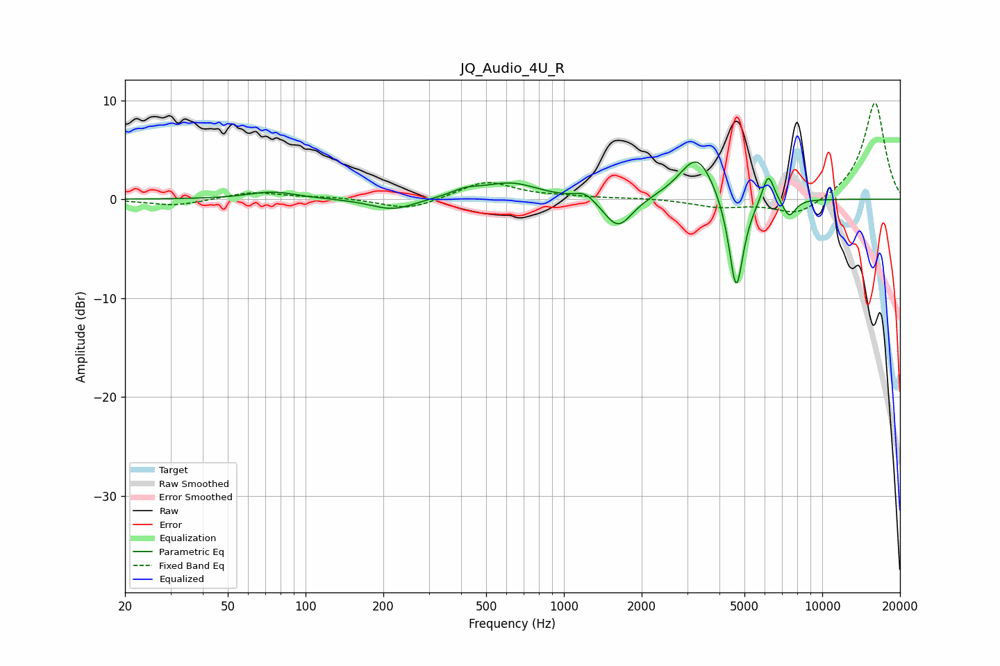

# JQ_Audio_4U_R
See [usage instructions](https://github.com/jaakkopasanen/AutoEq#usage) for more options and info.

### Parametric EQs
Apply preamp of -3.9 dB when using parametric equalizer.

|   # | Type    |   Fc (Hz) |    Q |   Gain (dB) |
|-----|---------|-----------|------|-------------|
|   1 | Peaking |        74 | 1.5  |         0.8 |
|   2 | Peaking |       217 | 1.67 |        -1.1 |
|   3 | Peaking |       416 | 2.4  |         0.7 |
|   4 | Peaking |       624 | 1.34 |         1.6 |
|   5 | Peaking |      1210 | 3.56 |         0.9 |
|   6 | Peaking |      1620 | 2.56 |        -3.2 |
|   7 | Peaking |      3282 | 2.05 |         4.7 |
|   8 | Peaking |      4645 | 4.84 |       -10.1 |
|   9 | Peaking |      6182 | 5.93 |         3   |
|  10 | Peaking |      7445 | 5.26 |        -1.8 |

### Fixed Band EQs
When using fixed band (also called graphic) equalizer, apply preamp of **-9.8 dB** (if available) and set gains manually with these parameters.

|   # | Type    |   Fc (Hz) |    Q |   Gain (dB) |
|-----|---------|-----------|------|-------------|
|   1 | Peaking |        31 | 1.41 |        -0.7 |
|   2 | Peaking |        62 | 1.41 |         0.7 |
|   3 | Peaking |       125 | 1.41 |         0.2 |
|   4 | Peaking |       250 | 1.41 |        -1.1 |
|   5 | Peaking |       500 | 1.41 |         1.8 |
|   6 | Peaking |      1000 | 1.41 |         0.2 |
|   7 | Peaking |      2000 | 1.41 |         0.1 |
|   8 | Peaking |      4000 | 1.41 |        -0.8 |
|   9 | Peaking |      8000 | 1.41 |        -1.7 |
|  10 | Peaking |     16000 | 1.41 |         9.9 |

### Graphs

