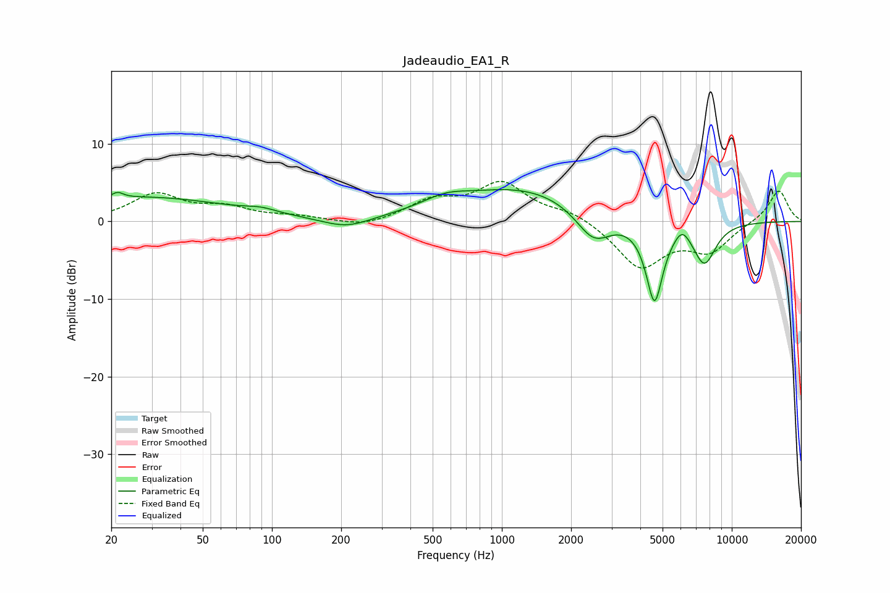

# Jadeaudio_EA1_R
See [usage instructions](https://github.com/jaakkopasanen/AutoEq#usage) for more options and info.

### Parametric EQs
Apply preamp of -4.2 dB when using parametric equalizer.

|   # | Type    |   Fc (Hz) |    Q |   Gain (dB) |
|-----|---------|-----------|------|-------------|
|   1 | Peaking |        21 | 5.76 |         0.8 |
|   2 | Peaking |        27 | 0.38 |         3.1 |
|   3 | Peaking |        90 | 2.14 |         0.5 |
|   4 | Peaking |       211 | 1.33 |        -1.4 |
|   5 | Peaking |       565 | 1.46 |         1.2 |
|   6 | Peaking |      1235 | 0.47 |         4.3 |
|   7 | Peaking |      2505 | 1.77 |        -4.3 |
|   8 | Peaking |      4611 | 3.65 |       -10.4 |
|   9 | Peaking |      6085 | 4.01 |         1.7 |
|  10 | Peaking |      7600 | 2.64 |        -5.3 |

### Fixed Band EQs
When using fixed band (also called graphic) equalizer, apply preamp of **-5.3 dB** (if available) and set gains manually with these parameters.

|   # | Type    |   Fc (Hz) |    Q |   Gain (dB) |
|-----|---------|-----------|------|-------------|
|   1 | Peaking |        31 | 1.41 |         3.4 |
|   2 | Peaking |        62 | 1.41 |         1.6 |
|   3 | Peaking |       125 | 1.41 |         0.5 |
|   4 | Peaking |       250 | 1.41 |        -0.8 |
|   5 | Peaking |       500 | 1.41 |         2.4 |
|   6 | Peaking |      1000 | 1.41 |         4.7 |
|   7 | Peaking |      2000 | 1.41 |         1.2 |
|   8 | Peaking |      4000 | 1.41 |        -5.9 |
|   9 | Peaking |      8000 | 1.41 |        -3.6 |
|  10 | Peaking |     16000 | 1.41 |         4.1 |

### Graphs

