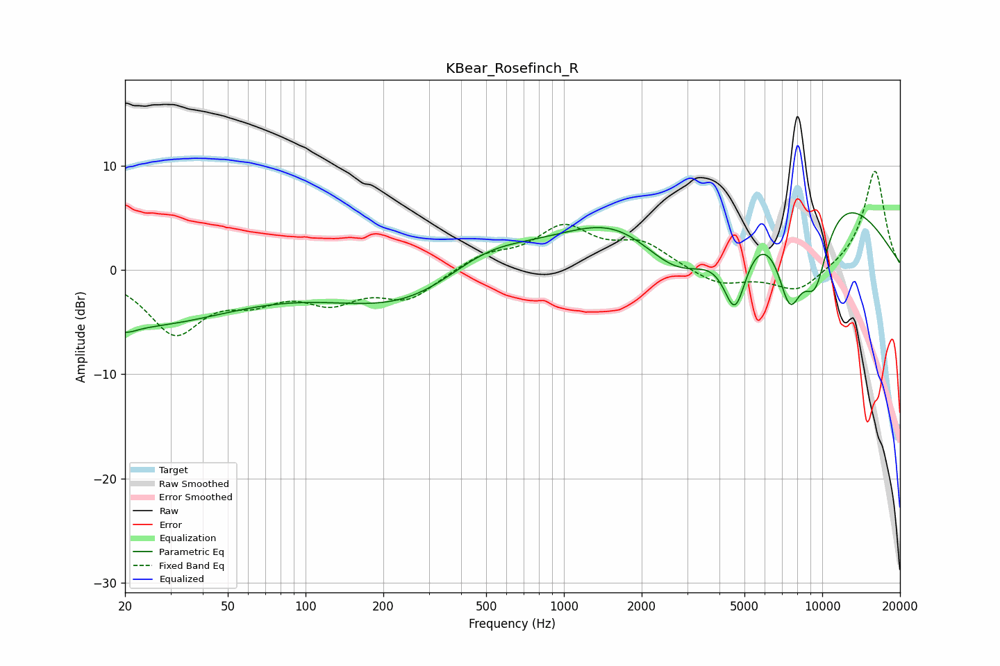

# KBear_Rosefinch_R
See [usage instructions](https://github.com/jaakkopasanen/AutoEq#usage) for more options and info.

### Parametric EQs
Apply preamp of -5.6 dB when using parametric equalizer.

|   # | Type    |   Fc (Hz) |    Q |   Gain (dB) |
|-----|---------|-----------|------|-------------|
|   1 | Peaking |        20 | 3.17 |        -0.8 |
|   2 | Peaking |        22 | 0.37 |        -5.1 |
|   3 | Peaking |       293 | 0.45 |        -5   |
|   4 | Peaking |       490 | 0.68 |         4.6 |
|   5 | Peaking |      1639 | 0.63 |         5.3 |
|   6 | Peaking |      2799 | 0.8  |        -6.9 |
|   7 | Peaking |      4599 | 2.94 |        -7.2 |
|   8 | Peaking |      7491 | 2.45 |        -8.8 |
|   9 | Peaking |      8130 | 0.36 |        10   |
|  10 | Peaking |      9387 | 2.24 |        -7.8 |

### Fixed Band EQs
When using fixed band (also called graphic) equalizer, apply preamp of **-9.6 dB** (if available) and set gains manually with these parameters.

|   # | Type    |   Fc (Hz) |    Q |   Gain (dB) |
|-----|---------|-----------|------|-------------|
|   1 | Peaking |        31 | 1.41 |        -5.8 |
|   2 | Peaking |        62 | 1.41 |        -2.2 |
|   3 | Peaking |       125 | 1.41 |        -2.6 |
|   4 | Peaking |       250 | 1.41 |        -2.6 |
|   5 | Peaking |       500 | 1.41 |         1.4 |
|   6 | Peaking |      1000 | 1.41 |         3.9 |
|   7 | Peaking |      2000 | 1.41 |         2.4 |
|   8 | Peaking |      4000 | 1.41 |        -1.5 |
|   9 | Peaking |      8000 | 1.41 |        -2.2 |
|  10 | Peaking |     16000 | 1.41 |         9.6 |

### Graphs

