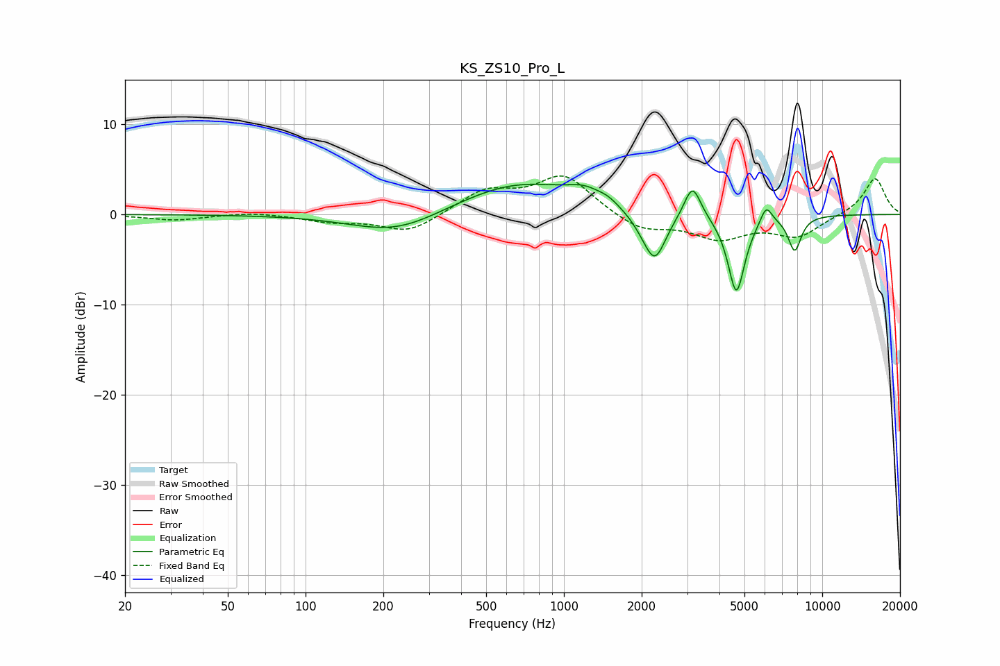

# KS_ZS10_Pro_L
See [usage instructions](https://github.com/jaakkopasanen/AutoEq#usage) for more options and info.

### Parametric EQs
Apply preamp of -3.4 dB when using parametric equalizer.

|   # | Type    |   Fc (Hz) |    Q |   Gain (dB) |
|-----|---------|-----------|------|-------------|
|   1 | Peaking |       225 | 0.81 |        -2.4 |
|   2 | Peaking |       667 | 0.59 |         3.6 |
|   3 | Peaking |      1207 | 2.1  |         1.2 |
|   4 | Peaking |      1483 | 3.63 |         0.5 |
|   5 | Peaking |      2024 | 2.66 |        -0.9 |
|   6 | Peaking |      2251 | 3.26 |        -5.1 |
|   7 | Peaking |      3145 | 4.37 |         3.8 |
|   8 | Peaking |      4651 | 4.23 |        -8.8 |
|   9 | Peaking |      6067 | 6    |         2.1 |
|  10 | Peaking |      7824 | 5.27 |        -3.9 |

### Fixed Band EQs
When using fixed band (also called graphic) equalizer, apply preamp of **-4.4 dB** (if available) and set gains manually with these parameters.

|   # | Type    |   Fc (Hz) |    Q |   Gain (dB) |
|-----|---------|-----------|------|-------------|
|   1 | Peaking |        31 | 1.41 |        -0.6 |
|   2 | Peaking |        62 | 1.41 |         0.3 |
|   3 | Peaking |       125 | 1.41 |        -0.7 |
|   4 | Peaking |       250 | 1.41 |        -2.1 |
|   5 | Peaking |       500 | 1.41 |         2.5 |
|   6 | Peaking |      1000 | 1.41 |         4.3 |
|   7 | Peaking |      2000 | 1.41 |        -1.8 |
|   8 | Peaking |      4000 | 1.41 |        -2.5 |
|   9 | Peaking |      8000 | 1.41 |        -2.3 |
|  10 | Peaking |     16000 | 1.41 |         4.1 |

### Graphs

