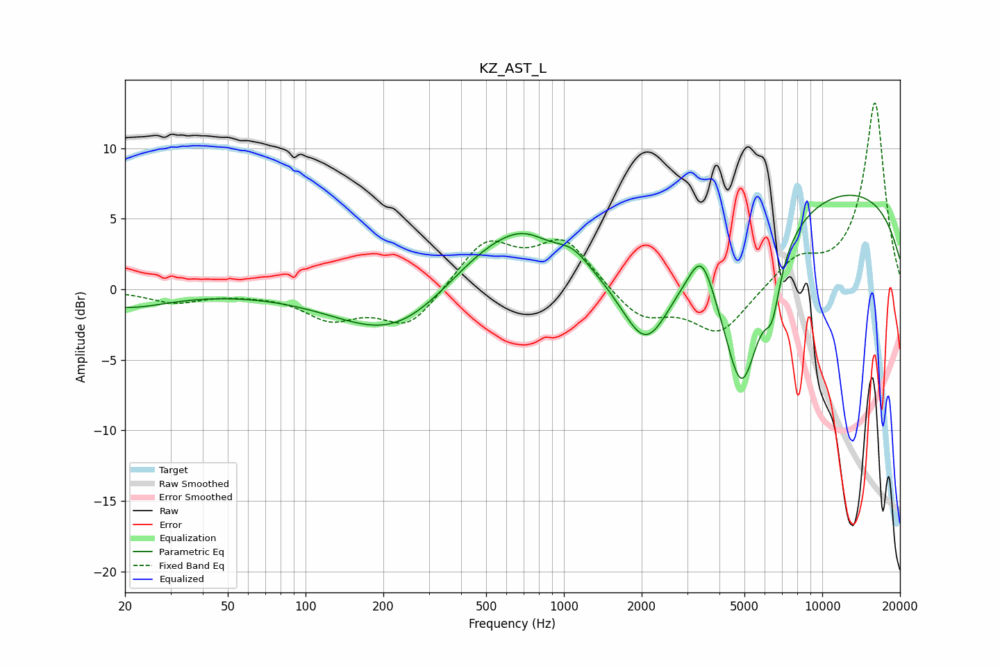

# KZ_AST_L
See [usage instructions](https://github.com/jaakkopasanen/AutoEq#usage) for more options and info.

### Parametric EQs
Apply preamp of -6.8 dB when using parametric equalizer.

|   # | Type    |   Fc (Hz) |    Q |   Gain (dB) |
|-----|---------|-----------|------|-------------|
|   1 | Peaking |        20 | 0.85 |        -1.2 |
|   2 | Peaking |       224 | 0.63 |        -3.7 |
|   3 | Peaking |       552 | 0.7  |         4   |
|   4 | Peaking |       705 | 1.65 |         0.9 |
|   5 | Peaking |      1083 | 2.16 |         1.1 |
|   6 | Peaking |      2079 | 1.4  |        -6.2 |
|   7 | Peaking |      3412 | 2.97 |         2.9 |
|   8 | Peaking |      4881 | 1.65 |       -12.3 |
|   9 | Peaking |      6404 | 4.51 |        -3.1 |
|  10 | Peaking |      9729 | 0.2  |         7.5 |

### Fixed Band EQs
When using fixed band (also called graphic) equalizer, apply preamp of **-13.3 dB** (if available) and set gains manually with these parameters.

|   # | Type    |   Fc (Hz) |    Q |   Gain (dB) |
|-----|---------|-----------|------|-------------|
|   1 | Peaking |        31 | 1.41 |        -0.9 |
|   2 | Peaking |        62 | 1.41 |        -0.2 |
|   3 | Peaking |       125 | 1.41 |        -1.9 |
|   4 | Peaking |       250 | 1.41 |        -2.7 |
|   5 | Peaking |       500 | 1.41 |         3.4 |
|   6 | Peaking |      1000 | 1.41 |         3.4 |
|   7 | Peaking |      2000 | 1.41 |        -2.1 |
|   8 | Peaking |      4000 | 1.41 |        -3.2 |
|   9 | Peaking |      8000 | 1.41 |         2   |
|  10 | Peaking |     16000 | 1.41 |        13.2 |

### Graphs

