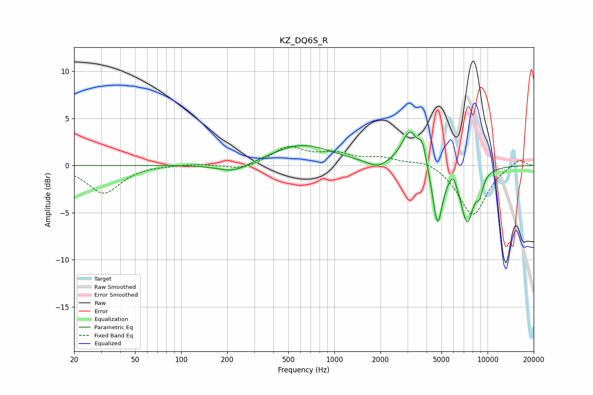

# KZ_DQ6S_R
See [usage instructions](https://github.com/jaakkopasanen/AutoEq#usage) for more options and info.

### Parametric EQs
Apply preamp of -3.6 dB when using parametric equalizer.

|   # | Type    |   Fc (Hz) |    Q |   Gain (dB) |
|-----|---------|-----------|------|-------------|
|   1 | Peaking |       218 | 1.55 |         0   |
|   2 | Peaking |       221 | 1.34 |        -1   |
|   3 | Peaking |       613 | 0.71 |         2.2 |
|   4 | Peaking |      1912 | 2.31 |        -0.7 |
|   5 | Peaking |      3118 | 2.62 |         3.7 |
|   6 | Peaking |      3758 | 6    |         1.9 |
|   7 | Peaking |      4713 | 4.44 |        -6.3 |
|   8 | Peaking |      5956 | 6    |         1.2 |
|   9 | Peaking |      7361 | 3    |        -5.8 |
|  10 | Peaking |      8884 | 5.96 |        -1.7 |

### Fixed Band EQs
When using fixed band (also called graphic) equalizer, apply preamp of **-2.1 dB** (if available) and set gains manually with these parameters.

|   # | Type    |   Fc (Hz) |    Q |   Gain (dB) |
|-----|---------|-----------|------|-------------|
|   1 | Peaking |        31 | 1.41 |        -2.9 |
|   2 | Peaking |        62 | 1.41 |         0.1 |
|   3 | Peaking |       125 | 1.41 |         0.2 |
|   4 | Peaking |       250 | 1.41 |        -0.5 |
|   5 | Peaking |       500 | 1.41 |         1.9 |
|   6 | Peaking |      1000 | 1.41 |         1.1 |
|   7 | Peaking |      2000 | 1.41 |         0.7 |
|   8 | Peaking |      4000 | 1.41 |         0.7 |
|   9 | Peaking |      8000 | 1.41 |        -5.3 |
|  10 | Peaking |     16000 | 1.41 |         0.8 |

### Graphs

