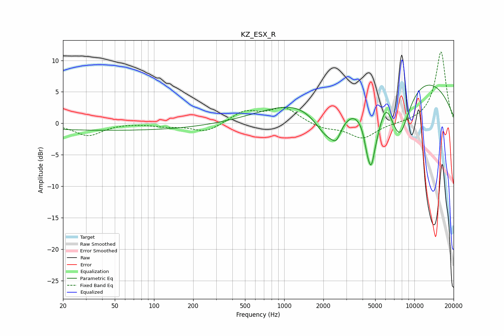

# KZ_ESX_R
See [usage instructions](https://github.com/jaakkopasanen/AutoEq#usage) for more options and info.

### Parametric EQs
Apply preamp of -6.2 dB when using parametric equalizer.

|   # | Type    |   Fc (Hz) |    Q |   Gain (dB) |
|-----|---------|-----------|------|-------------|
|   1 | Peaking |        51 | 0.18 |        -1.1 |
|   2 | Peaking |      2188 | 1.14 |        -8.1 |
|   3 | Peaking |      2515 | 4.49 |        -1.6 |
|   4 | Peaking |      2642 | 1.84 |        -0.6 |
|   5 | Peaking |      4346 | 5.86 |        -2.3 |
|   6 | Peaking |      4659 | 6    |        -3.9 |
|   7 | Peaking |      4895 | 1.65 |        -8.6 |
|   8 | Peaking |      5716 | 0.18 |         9.9 |
|   9 | Peaking |      5975 | 2.61 |         3.6 |
|  10 | Peaking |      7700 | 1.57 |        -9.3 |

### Fixed Band EQs
When using fixed band (also called graphic) equalizer, apply preamp of **-11.4 dB** (if available) and set gains manually with these parameters.

|   # | Type    |   Fc (Hz) |    Q |   Gain (dB) |
|-----|---------|-----------|------|-------------|
|   1 | Peaking |        31 | 1.41 |        -1.9 |
|   2 | Peaking |        62 | 1.41 |         0.1 |
|   3 | Peaking |       125 | 1.41 |        -0.4 |
|   4 | Peaking |       250 | 1.41 |        -1.4 |
|   5 | Peaking |       500 | 1.41 |         1.9 |
|   6 | Peaking |      1000 | 1.41 |         2.4 |
|   7 | Peaking |      2000 | 1.41 |        -0.8 |
|   8 | Peaking |      4000 | 1.41 |        -2.4 |
|   9 | Peaking |      8000 | 1.41 |        -0   |
|  10 | Peaking |     16000 | 1.41 |        11.4 |

### Graphs

