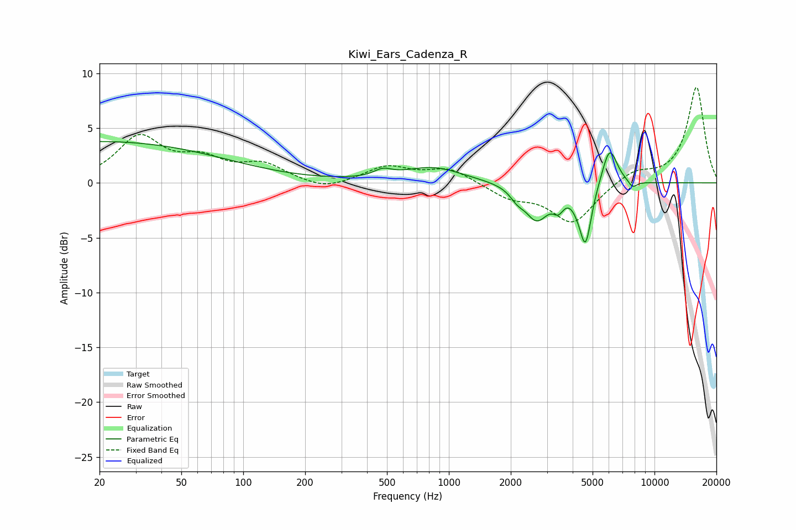

# Kiwi_Ears_Cadenza_R
See [usage instructions](https://github.com/jaakkopasanen/AutoEq#usage) for more options and info.

### Parametric EQs
Apply preamp of -3.9 dB when using parametric equalizer.

|   # | Type    |   Fc (Hz) |    Q |   Gain (dB) |
|-----|---------|-----------|------|-------------|
|   1 | Peaking |        20 | 0.22 |         3.8 |
|   2 | Peaking |       478 | 3.36 |         0.6 |
|   3 | Peaking |       835 | 0.98 |         1.4 |
|   4 | Peaking |      2145 | 4.33 |        -0.7 |
|   5 | Peaking |      2674 | 2.43 |        -3.2 |
|   6 | Peaking |      3408 | 5.31 |        -1.3 |
|   7 | Peaking |      4161 | 5.99 |        -0.4 |
|   8 | Peaking |      4615 | 4.79 |        -5.4 |
|   9 | Peaking |      6050 | 3.74 |         3.5 |
|  10 | Peaking |      7824 | 6    |        -0.6 |

### Fixed Band EQs
When using fixed band (also called graphic) equalizer, apply preamp of **-8.8 dB** (if available) and set gains manually with these parameters.

|   # | Type    |   Fc (Hz) |    Q |   Gain (dB) |
|-----|---------|-----------|------|-------------|
|   1 | Peaking |        31 | 1.41 |         4   |
|   2 | Peaking |        62 | 1.41 |         1.8 |
|   3 | Peaking |       125 | 1.41 |         1.5 |
|   4 | Peaking |       250 | 1.41 |        -0.7 |
|   5 | Peaking |       500 | 1.41 |         1.4 |
|   6 | Peaking |      1000 | 1.41 |         1.3 |
|   7 | Peaking |      2000 | 1.41 |        -1.3 |
|   8 | Peaking |      4000 | 1.41 |        -3.6 |
|   9 | Peaking |      8000 | 1.41 |         1.1 |
|  10 | Peaking |     16000 | 1.41 |         8.7 |

### Graphs

