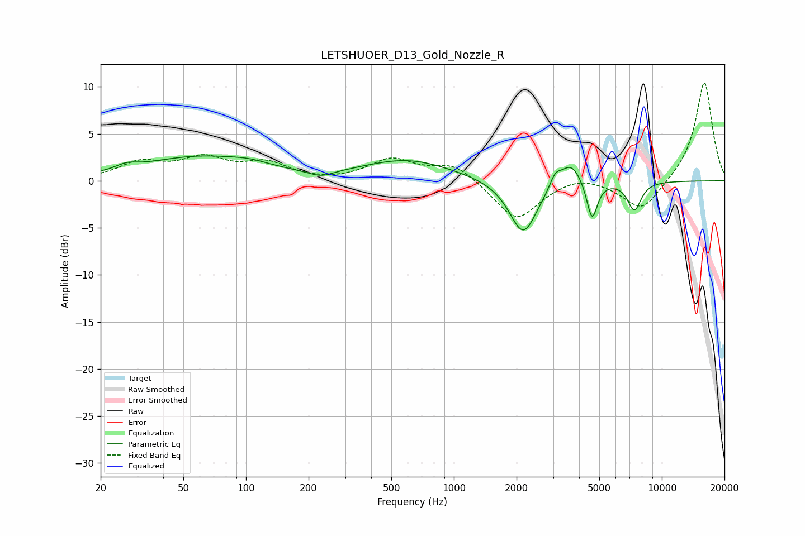

# LETSHUOER_D13_Gold_Nozzle_R
See [usage instructions](https://github.com/jaakkopasanen/AutoEq#usage) for more options and info.

### Parametric EQs
Apply preamp of -2.7 dB when using parametric equalizer.

|   # | Type    |   Fc (Hz) |    Q |   Gain (dB) |
|-----|---------|-----------|------|-------------|
|   1 | Peaking |        27 | 2.76 |         0.6 |
|   2 | Peaking |        59 | 0.51 |         2.5 |
|   3 | Peaking |       104 | 1.53 |         0.4 |
|   4 | Peaking |       230 | 2.31 |        -0.7 |
|   5 | Peaking |       600 | 0.67 |         2.2 |
|   6 | Peaking |      2155 | 2.11 |        -5.8 |
|   7 | Peaking |      3070 | 5.48 |         1.3 |
|   8 | Peaking |      3649 | 2.74 |         2.5 |
|   9 | Peaking |      4616 | 5.5  |        -4.2 |
|  10 | Peaking |      7371 | 4.14 |        -3   |

### Fixed Band EQs
When using fixed band (also called graphic) equalizer, apply preamp of **-10.5 dB** (if available) and set gains manually with these parameters.

|   # | Type    |   Fc (Hz) |    Q |   Gain (dB) |
|-----|---------|-----------|------|-------------|
|   1 | Peaking |        31 | 1.41 |         1.8 |
|   2 | Peaking |        62 | 1.41 |         2.1 |
|   3 | Peaking |       125 | 1.41 |         1.7 |
|   4 | Peaking |       250 | 1.41 |        -0.2 |
|   5 | Peaking |       500 | 1.41 |         2.2 |
|   6 | Peaking |      1000 | 1.41 |         1.8 |
|   7 | Peaking |      2000 | 1.41 |        -4.3 |
|   8 | Peaking |      4000 | 1.41 |         0.8 |
|   9 | Peaking |      8000 | 1.41 |        -3.3 |
|  10 | Peaking |     16000 | 1.41 |        10.6 |

### Graphs

