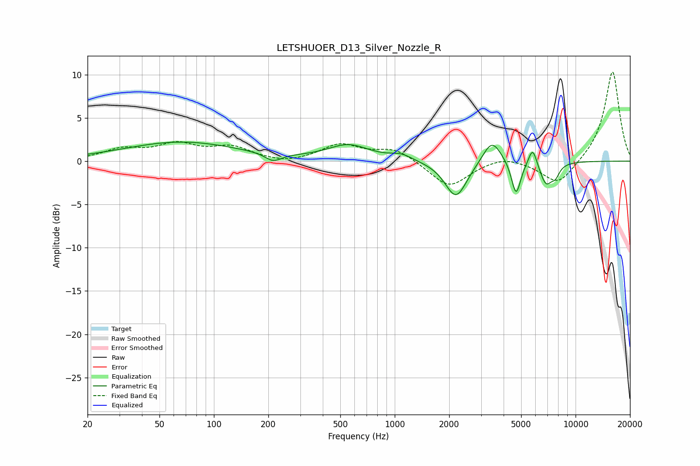

# LETSHUOER_D13_Silver_Nozzle_R
See [usage instructions](https://github.com/jaakkopasanen/AutoEq#usage) for more options and info.

### Parametric EQs
Apply preamp of -2.3 dB when using parametric equalizer.

|   # | Type    |   Fc (Hz) |    Q |   Gain (dB) |
|-----|---------|-----------|------|-------------|
|   1 | Peaking |        66 | 0.45 |         2.2 |
|   2 | Peaking |       213 | 3.13 |        -0.9 |
|   3 | Peaking |       555 | 1.23 |         1.8 |
|   4 | Peaking |      1087 | 2.35 |         0.7 |
|   5 | Peaking |      2182 | 2.32 |        -4.3 |
|   6 | Peaking |      3448 | 2.77 |         2.8 |
|   7 | Peaking |      4688 | 5.59 |        -4   |
|   8 | Peaking |      5793 | 5.97 |         2.2 |
|   9 | Peaking |      6872 | 3.93 |        -2.6 |
|  10 | Peaking |      7746 | 5.95 |        -1.1 |

### Fixed Band EQs
When using fixed band (also called graphic) equalizer, apply preamp of **-10.4 dB** (if available) and set gains manually with these parameters.

|   # | Type    |   Fc (Hz) |    Q |   Gain (dB) |
|-----|---------|-----------|------|-------------|
|   1 | Peaking |        31 | 1.41 |         1.2 |
|   2 | Peaking |        62 | 1.41 |         1.7 |
|   3 | Peaking |       125 | 1.41 |         1.5 |
|   4 | Peaking |       250 | 1.41 |        -0.4 |
|   5 | Peaking |       500 | 1.41 |         1.8 |
|   6 | Peaking |      1000 | 1.41 |         1.4 |
|   7 | Peaking |      2000 | 1.41 |        -3.1 |
|   8 | Peaking |      4000 | 1.41 |         0.7 |
|   9 | Peaking |      8000 | 1.41 |        -2.9 |
|  10 | Peaking |     16000 | 1.41 |        10.5 |

### Graphs

