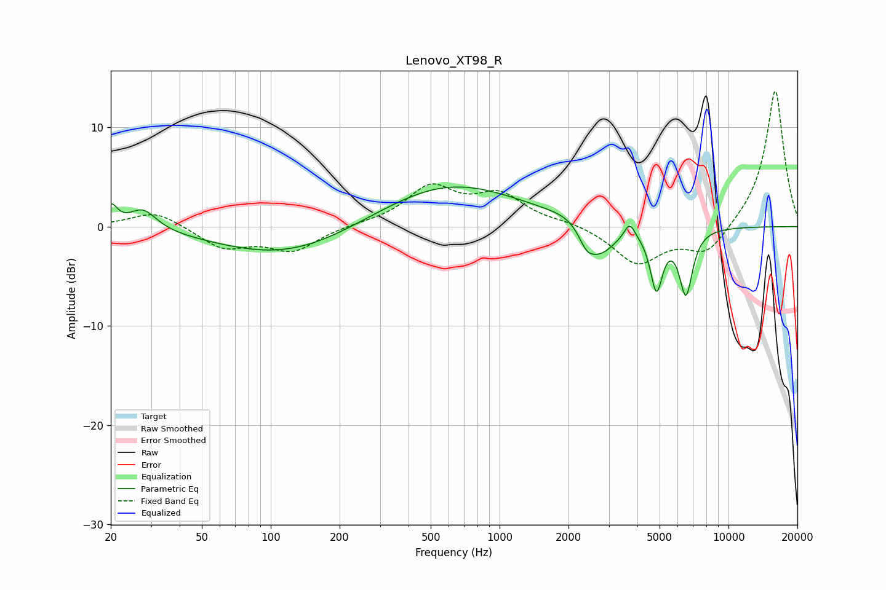

# Lenovo_XT98_R
See [usage instructions](https://github.com/jaakkopasanen/AutoEq#usage) for more options and info.

### Parametric EQs
Apply preamp of -4.1 dB when using parametric equalizer.

|   # | Type    |   Fc (Hz) |    Q |   Gain (dB) |
|-----|---------|-----------|------|-------------|
|   1 | Peaking |        20 | 5.13 |         2   |
|   2 | Peaking |        28 | 2.39 |         2.1 |
|   3 | Peaking |       117 | 0.47 |        -3   |
|   4 | Peaking |       601 | 0.46 |         4.4 |
|   5 | Peaking |      2276 | 1.51 |         1.4 |
|   6 | Peaking |      2390 | 3.92 |        -1.6 |
|   7 | Peaking |      2708 | 1.85 |        -3.9 |
|   8 | Peaking |      3699 | 5.96 |         1.6 |
|   9 | Peaking |      4844 | 5.19 |        -5.9 |
|  10 | Peaking |      6516 | 4.68 |        -6.5 |

### Fixed Band EQs
When using fixed band (also called graphic) equalizer, apply preamp of **-13.7 dB** (if available) and set gains manually with these parameters.

|   # | Type    |   Fc (Hz) |    Q |   Gain (dB) |
|-----|---------|-----------|------|-------------|
|   1 | Peaking |        31 | 1.41 |         1.6 |
|   2 | Peaking |        62 | 1.41 |        -2.1 |
|   3 | Peaking |       125 | 1.41 |        -2.4 |
|   4 | Peaking |       250 | 1.41 |         0.2 |
|   5 | Peaking |       500 | 1.41 |         3.8 |
|   6 | Peaking |      1000 | 1.41 |         3   |
|   7 | Peaking |      2000 | 1.41 |         0.4 |
|   8 | Peaking |      4000 | 1.41 |        -3.7 |
|   9 | Peaking |      8000 | 1.41 |        -2.8 |
|  10 | Peaking |     16000 | 1.41 |        13.9 |

### Graphs

