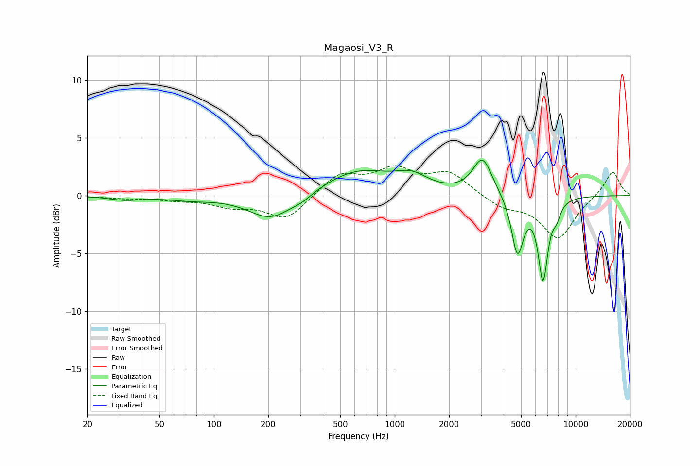

# Magaosi_V3_R
See [usage instructions](https://github.com/jaakkopasanen/AutoEq#usage) for more options and info.

### Parametric EQs
Apply preamp of -3.2 dB when using parametric equalizer.

|   # | Type    |   Fc (Hz) |    Q |   Gain (dB) |
|-----|---------|-----------|------|-------------|
|   1 | Peaking |        32 | 1.72 |        -0.3 |
|   2 | Peaking |        74 | 1.16 |        -0.3 |
|   3 | Peaking |       208 | 1.14 |        -2.2 |
|   4 | Peaking |       308 | 2.73 |        -0.4 |
|   5 | Peaking |       627 | 0.75 |         2.1 |
|   6 | Peaking |      1244 | 1.59 |         1.1 |
|   7 | Peaking |      3057 | 2.65 |         3.2 |
|   8 | Peaking |      4773 | 4.23 |        -5   |
|   9 | Peaking |      6610 | 5.02 |        -6.9 |
|  10 | Peaking |      7853 | 6    |        -1.1 |

### Fixed Band EQs
When using fixed band (also called graphic) equalizer, apply preamp of **-2.7 dB** (if available) and set gains manually with these parameters.

|   # | Type    |   Fc (Hz) |    Q |   Gain (dB) |
|-----|---------|-----------|------|-------------|
|   1 | Peaking |        31 | 1.41 |        -0.2 |
|   2 | Peaking |        62 | 1.41 |        -0.3 |
|   3 | Peaking |       125 | 1.41 |        -0.8 |
|   4 | Peaking |       250 | 1.41 |        -2.1 |
|   5 | Peaking |       500 | 1.41 |         1.8 |
|   6 | Peaking |      1000 | 1.41 |         2   |
|   7 | Peaking |      2000 | 1.41 |         1.9 |
|   8 | Peaking |      4000 | 1.41 |        -1   |
|   9 | Peaking |      8000 | 1.41 |        -3.7 |
|  10 | Peaking |     16000 | 1.41 |         2.2 |

### Graphs

