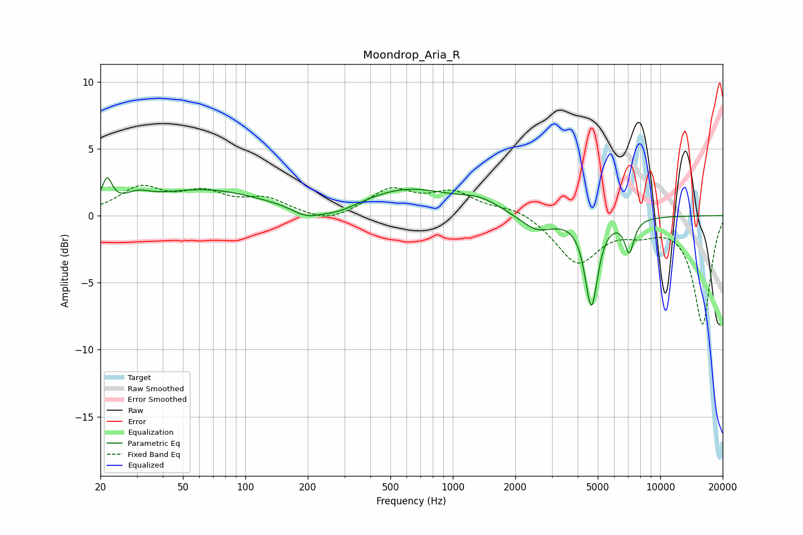

# Moondrop_Aria_R
See [usage instructions](https://github.com/jaakkopasanen/AutoEq#usage) for more options and info.

### Parametric EQs
Apply preamp of -2.9 dB when using parametric equalizer.

|   # | Type    |   Fc (Hz) |    Q |   Gain (dB) |
|-----|---------|-----------|------|-------------|
|   1 | Peaking |        22 | 6    |         2   |
|   2 | Peaking |        30 | 2.38 |         0.7 |
|   3 | Peaking |        63 | 0.52 |         1.9 |
|   4 | Peaking |       195 | 2.13 |        -0.7 |
|   5 | Peaking |       276 | 1.39 |        -0.7 |
|   6 | Peaking |       603 | 0.65 |         1.9 |
|   7 | Peaking |      1345 | 1.44 |         0.8 |
|   8 | Peaking |      2544 | 1.75 |        -1.2 |
|   9 | Peaking |      4656 | 4.55 |        -6.6 |
|  10 | Peaking |      7093 | 5.98 |        -2.5 |

### Fixed Band EQs
When using fixed band (also called graphic) equalizer, apply preamp of **-2.4 dB** (if available) and set gains manually with these parameters.

|   # | Type    |   Fc (Hz) |    Q |   Gain (dB) |
|-----|---------|-----------|------|-------------|
|   1 | Peaking |        31 | 1.41 |         1.9 |
|   2 | Peaking |        62 | 1.41 |         1.5 |
|   3 | Peaking |       125 | 1.41 |         1.1 |
|   4 | Peaking |       250 | 1.41 |        -0.7 |
|   5 | Peaking |       500 | 1.41 |         1.9 |
|   6 | Peaking |      1000 | 1.41 |         1.6 |
|   7 | Peaking |      2000 | 1.41 |         0.6 |
|   8 | Peaking |      4000 | 1.41 |        -3.5 |
|   9 | Peaking |      8000 | 1.41 |        -0.9 |
|  10 | Peaking |     16000 | 1.41 |        -8.1 |

### Graphs

