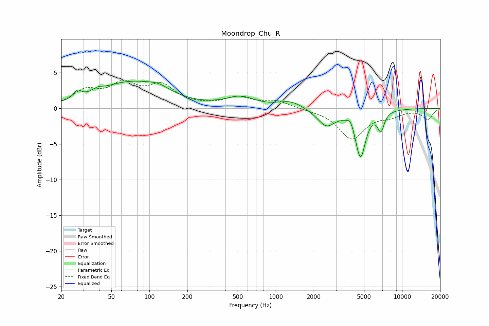

# Moondrop_Chu_R
See [usage instructions](https://github.com/jaakkopasanen/AutoEq#usage) for more options and info.

### Parametric EQs
Apply preamp of -3.9 dB when using parametric equalizer.

|   # | Type    |   Fc (Hz) |    Q |   Gain (dB) |
|-----|---------|-----------|------|-------------|
|   1 | Peaking |        27 | 4.8  |         1   |
|   2 | Peaking |        39 | 3.45 |         0.5 |
|   3 | Peaking |        71 | 0.54 |         3.6 |
|   4 | Peaking |       119 | 1.7  |         0.8 |
|   5 | Peaking |       524 | 1.24 |         1.4 |
|   6 | Peaking |      1316 | 1.46 |         1   |
|   7 | Peaking |      2516 | 1.95 |        -2.4 |
|   8 | Peaking |      3905 | 6    |         0.9 |
|   9 | Peaking |      4689 | 3.49 |        -6.6 |
|  10 | Peaking |      6801 | 5.19 |        -2.5 |

### Fixed Band EQs
When using fixed band (also called graphic) equalizer, apply preamp of **-4.1 dB** (if available) and set gains manually with these parameters.

|   # | Type    |   Fc (Hz) |    Q |   Gain (dB) |
|-----|---------|-----------|------|-------------|
|   1 | Peaking |        31 | 1.41 |         2.2 |
|   2 | Peaking |        62 | 1.41 |         3   |
|   3 | Peaking |       125 | 1.41 |         2.9 |
|   4 | Peaking |       250 | 1.41 |         0.2 |
|   5 | Peaking |       500 | 1.41 |         1.4 |
|   6 | Peaking |      1000 | 1.41 |         1   |
|   7 | Peaking |      2000 | 1.41 |        -0.1 |
|   8 | Peaking |      4000 | 1.41 |        -4.2 |
|   9 | Peaking |      8000 | 1.41 |        -0.9 |
|  10 | Peaking |     16000 | 1.41 |        -1.5 |

### Graphs

