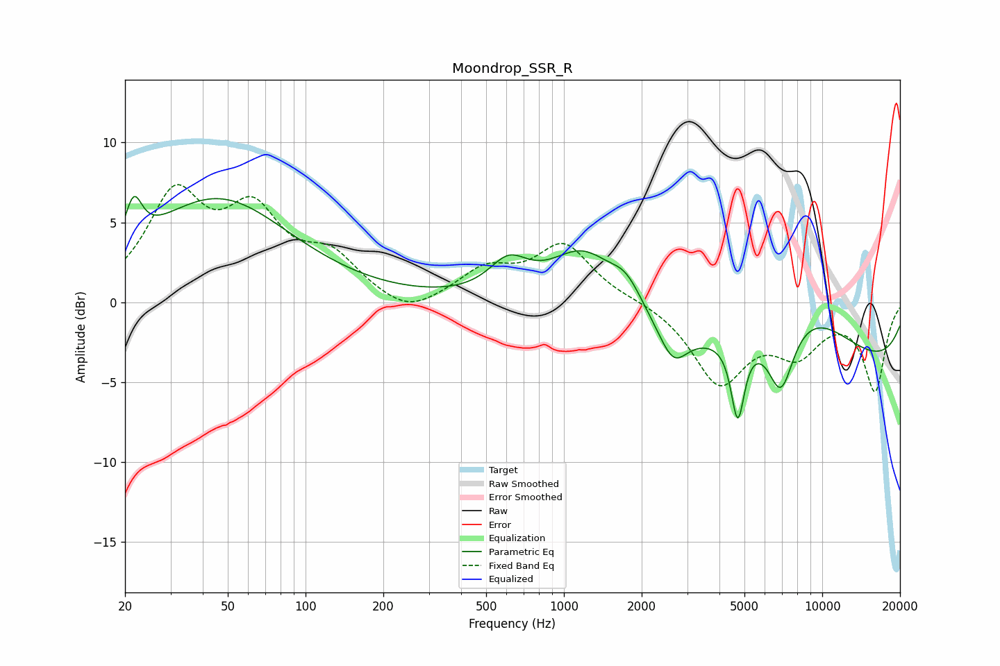

# Moondrop_SSR_R
See [usage instructions](https://github.com/jaakkopasanen/AutoEq#usage) for more options and info.

### Parametric EQs
Apply preamp of -6.7 dB when using parametric equalizer.

|   # | Type    |   Fc (Hz) |    Q |   Gain (dB) |
|-----|---------|-----------|------|-------------|
|   1 | Peaking |        22 | 4.44 |         2.8 |
|   2 | Peaking |        46 | 0.5  |         6.4 |
|   3 | Peaking |       610 | 1.88 |         2   |
|   4 | Peaking |      1191 | 1.1  |         3.6 |
|   5 | Peaking |      1744 | 2.3  |         1.5 |
|   6 | Peaking |      2648 | 2.56 |        -2.3 |
|   7 | Peaking |      4710 | 5.42 |        -4.9 |
|   8 | Peaking |      6916 | 2.61 |        -4.4 |
|   9 | Peaking |      8246 | 0.61 |         4   |
|  10 | Peaking |     10000 | 0.18 |        -4.6 |

### Fixed Band EQs
When using fixed band (also called graphic) equalizer, apply preamp of **-7.5 dB** (if available) and set gains manually with these parameters.

|   # | Type    |   Fc (Hz) |    Q |   Gain (dB) |
|-----|---------|-----------|------|-------------|
|   1 | Peaking |        31 | 1.41 |         6.3 |
|   2 | Peaking |        62 | 1.41 |         4.9 |
|   3 | Peaking |       125 | 1.41 |         2.5 |
|   4 | Peaking |       250 | 1.41 |        -1.1 |
|   5 | Peaking |       500 | 1.41 |         1.9 |
|   6 | Peaking |      1000 | 1.41 |         3.5 |
|   7 | Peaking |      2000 | 1.41 |         0.1 |
|   8 | Peaking |      4000 | 1.41 |        -4.9 |
|   9 | Peaking |      8000 | 1.41 |        -2.8 |
|  10 | Peaking |     16000 | 1.41 |        -5.4 |

### Graphs

