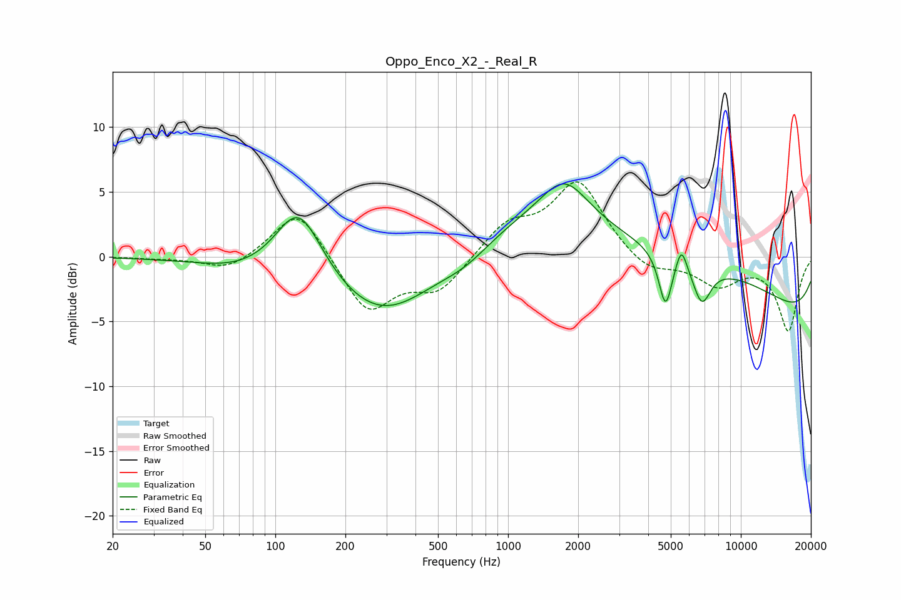

# Oppo_Enco_X2_-_Real_R
See [usage instructions](https://github.com/jaakkopasanen/AutoEq#usage) for more options and info.

### Parametric EQs
Apply preamp of -5.7 dB when using parametric equalizer.

|   # | Type    |   Fc (Hz) |    Q |   Gain (dB) |
|-----|---------|-----------|------|-------------|
|   1 | Peaking |        76 | 0.74 |        -1   |
|   2 | Peaking |       126 | 1.39 |         5.7 |
|   3 | Peaking |       289 | 0.61 |        -5.1 |
|   4 | Peaking |       661 | 1.23 |        -1.2 |
|   5 | Peaking |      1748 | 1.41 |         3.3 |
|   6 | Peaking |      3738 | 0.18 |         6   |
|   7 | Peaking |      4746 | 4.9  |        -4.1 |
|   8 | Peaking |      5555 | 5.9  |         1.9 |
|   9 | Peaking |      6795 | 3.47 |        -3   |
|  10 | Peaking |      9956 | 0.18 |        -6.3 |

### Fixed Band EQs
When using fixed band (also called graphic) equalizer, apply preamp of **-5.9 dB** (if available) and set gains manually with these parameters.

|   # | Type    |   Fc (Hz) |    Q |   Gain (dB) |
|-----|---------|-----------|------|-------------|
|   1 | Peaking |        31 | 1.41 |        -0.1 |
|   2 | Peaking |        62 | 1.41 |        -1.1 |
|   3 | Peaking |       125 | 1.41 |         3.9 |
|   4 | Peaking |       250 | 1.41 |        -4.3 |
|   5 | Peaking |       500 | 1.41 |        -2.6 |
|   6 | Peaking |      1000 | 1.41 |         2.4 |
|   7 | Peaking |      2000 | 1.41 |         5.7 |
|   8 | Peaking |      4000 | 1.41 |        -1.4 |
|   9 | Peaking |      8000 | 1.41 |        -2.1 |
|  10 | Peaking |     16000 | 1.41 |        -5.7 |

### Graphs

