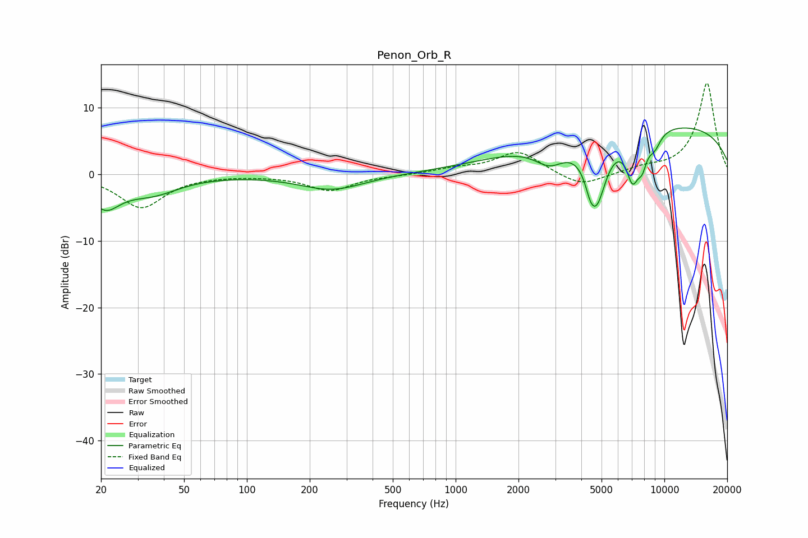

# Penon_Orb_R
See [usage instructions](https://github.com/jaakkopasanen/AutoEq#usage) for more options and info.

### Parametric EQs
Apply preamp of -7.0 dB when using parametric equalizer.

|   # | Type    |   Fc (Hz) |    Q |   Gain (dB) |
|-----|---------|-----------|------|-------------|
|   1 | Peaking |        21 | 1.94 |        -4.3 |
|   2 | Peaking |        35 | 1.08 |        -2.6 |
|   3 | Peaking |       256 | 0.92 |        -2.3 |
|   4 | Peaking |      2826 | 1.89 |        -3.1 |
|   5 | Peaking |      4419 | 5.98 |        -2   |
|   6 | Peaking |      4743 | 2.83 |        -9.5 |
|   7 | Peaking |      7047 | 4.32 |        -6.2 |
|   8 | Peaking |      7835 | 5.72 |        -3.2 |
|   9 | Peaking |      8918 | 0.19 |         7.7 |
|  10 | Peaking |      8963 | 4    |        -2.2 |

### Fixed Band EQs
When using fixed band (also called graphic) equalizer, apply preamp of **-13.8 dB** (if available) and set gains manually with these parameters.

|   # | Type    |   Fc (Hz) |    Q |   Gain (dB) |
|-----|---------|-----------|------|-------------|
|   1 | Peaking |        31 | 1.41 |        -5   |
|   2 | Peaking |        62 | 1.41 |        -0.1 |
|   3 | Peaking |       125 | 1.41 |        -0.1 |
|   4 | Peaking |       250 | 1.41 |        -2.4 |
|   5 | Peaking |       500 | 1.41 |        -0.1 |
|   6 | Peaking |      1000 | 1.41 |         0.7 |
|   7 | Peaking |      2000 | 1.41 |         3.4 |
|   8 | Peaking |      4000 | 1.41 |        -2   |
|   9 | Peaking |      8000 | 1.41 |         0.8 |
|  10 | Peaking |     16000 | 1.41 |        13.8 |

### Graphs

