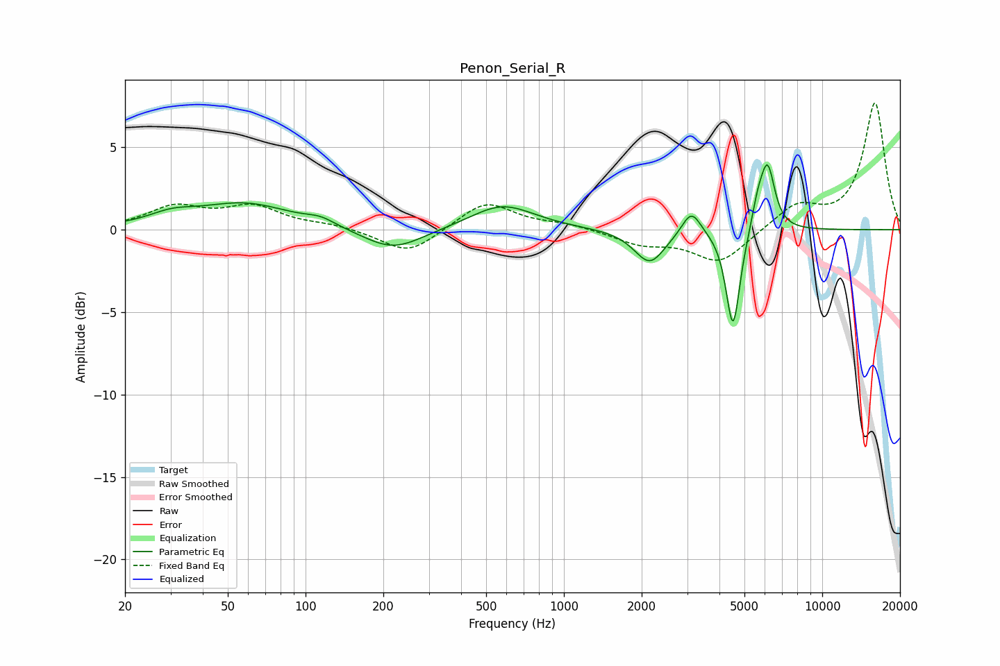

# Penon_Serial_R
See [usage instructions](https://github.com/jaakkopasanen/AutoEq#usage) for more options and info.

### Parametric EQs
Apply preamp of -4.0 dB when using parametric equalizer.

|   # | Type    |   Fc (Hz) |    Q |   Gain (dB) |
|-----|---------|-----------|------|-------------|
|   1 | Peaking |        30 | 1.62 |         0.6 |
|   2 | Peaking |        58 | 0.76 |         1.6 |
|   3 | Peaking |       114 | 2.51 |         0.4 |
|   4 | Peaking |       218 | 1.21 |        -1.4 |
|   5 | Peaking |       578 | 1.14 |         1.5 |
|   6 | Peaking |      2150 | 2.37 |        -2.1 |
|   7 | Peaking |      3115 | 3.85 |         1.5 |
|   8 | Peaking |      4515 | 5.19 |        -6.1 |
|   9 | Peaking |      5625 | 5.95 |         1.4 |
|  10 | Peaking |      6144 | 4.94 |         3.8 |

### Fixed Band EQs
When using fixed band (also called graphic) equalizer, apply preamp of **-7.8 dB** (if available) and set gains manually with these parameters.

|   # | Type    |   Fc (Hz) |    Q |   Gain (dB) |
|-----|---------|-----------|------|-------------|
|   1 | Peaking |        31 | 1.41 |         1.3 |
|   2 | Peaking |        62 | 1.41 |         1.3 |
|   3 | Peaking |       125 | 1.41 |         0.3 |
|   4 | Peaking |       250 | 1.41 |        -1.5 |
|   5 | Peaking |       500 | 1.41 |         1.7 |
|   6 | Peaking |      1000 | 1.41 |         0.3 |
|   7 | Peaking |      2000 | 1.41 |        -0.8 |
|   8 | Peaking |      4000 | 1.41 |        -2   |
|   9 | Peaking |      8000 | 1.41 |         1.5 |
|  10 | Peaking |     16000 | 1.41 |         7.7 |

### Graphs

