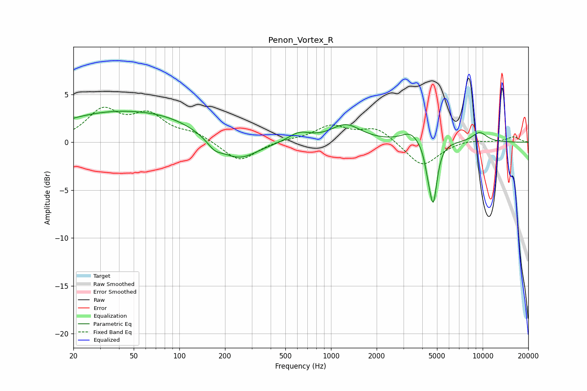

# Penon_Vortex_R
See [usage instructions](https://github.com/jaakkopasanen/AutoEq#usage) for more options and info.

### Parametric EQs
Apply preamp of -3.3 dB when using parametric equalizer.

|   # | Type    |   Fc (Hz) |    Q |   Gain (dB) |
|-----|---------|-----------|------|-------------|
|   1 | Peaking |        34 | 0.39 |         2.8 |
|   2 | Peaking |        90 | 0.61 |         1.2 |
|   3 | Peaking |       170 | 2.86 |        -0.9 |
|   4 | Peaking |       244 | 1.11 |        -2.2 |
|   5 | Peaking |       617 | 1.99 |         0.9 |
|   6 | Peaking |      1251 | 1.42 |         1.8 |
|   7 | Peaking |      3346 | 2.37 |         1.1 |
|   8 | Peaking |      4359 | 6    |        -1.5 |
|   9 | Peaking |      4726 | 5.58 |        -6   |
|  10 | Peaking |      9550 | 2.47 |         1   |

### Fixed Band EQs
When using fixed band (also called graphic) equalizer, apply preamp of **-3.8 dB** (if available) and set gains manually with these parameters.

|   # | Type    |   Fc (Hz) |    Q |   Gain (dB) |
|-----|---------|-----------|------|-------------|
|   1 | Peaking |        31 | 1.41 |         3.2 |
|   2 | Peaking |        62 | 1.41 |         2.6 |
|   3 | Peaking |       125 | 1.41 |         0.8 |
|   4 | Peaking |       250 | 1.41 |        -2.1 |
|   5 | Peaking |       500 | 1.41 |         0.2 |
|   6 | Peaking |      1000 | 1.41 |         1.6 |
|   7 | Peaking |      2000 | 1.41 |         1.5 |
|   8 | Peaking |      4000 | 1.41 |        -2.6 |
|   9 | Peaking |      8000 | 1.41 |         0.3 |
|  10 | Peaking |     16000 | 1.41 |         0.6 |

### Graphs

