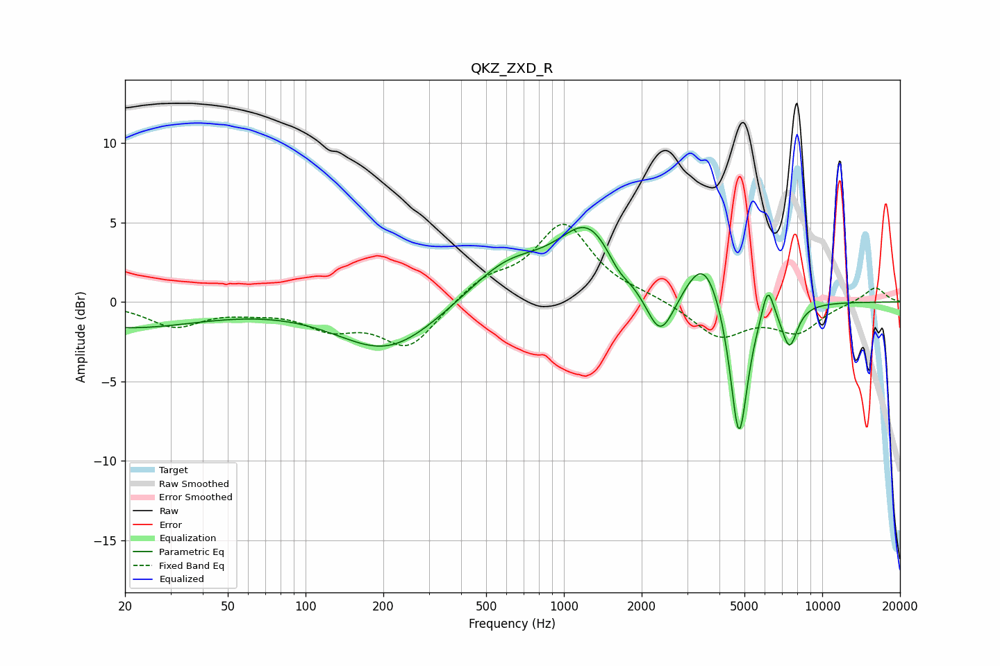

# QKZ_ZXD_R
See [usage instructions](https://github.com/jaakkopasanen/AutoEq#usage) for more options and info.

### Parametric EQs
Apply preamp of -4.8 dB when using parametric equalizer.

|   # | Type    |   Fc (Hz) |    Q |   Gain (dB) |
|-----|---------|-----------|------|-------------|
|   1 | Peaking |        20 | 0.47 |        -1.6 |
|   2 | Peaking |       208 | 0.73 |        -3.1 |
|   3 | Peaking |       603 | 0.92 |         2.4 |
|   4 | Peaking |      1250 | 1.2  |         4.4 |
|   5 | Peaking |      1626 | 3.05 |        -0.9 |
|   6 | Peaking |      2359 | 2.51 |        -3.3 |
|   7 | Peaking |      3486 | 2.04 |         3.1 |
|   8 | Peaking |      4760 | 4.05 |        -9.2 |
|   9 | Peaking |      6155 | 5.98 |         2.1 |
|  10 | Peaking |      7469 | 4.31 |        -2.7 |

### Fixed Band EQs
When using fixed band (also called graphic) equalizer, apply preamp of **-5.0 dB** (if available) and set gains manually with these parameters.

|   # | Type    |   Fc (Hz) |    Q |   Gain (dB) |
|-----|---------|-----------|------|-------------|
|   1 | Peaking |        31 | 1.41 |        -1.5 |
|   2 | Peaking |        62 | 1.41 |        -0.4 |
|   3 | Peaking |       125 | 1.41 |        -1.4 |
|   4 | Peaking |       250 | 1.41 |        -2.8 |
|   5 | Peaking |       500 | 1.41 |         1.3 |
|   6 | Peaking |      1000 | 1.41 |         4.8 |
|   7 | Peaking |      2000 | 1.41 |         0.3 |
|   8 | Peaking |      4000 | 1.41 |        -2.2 |
|   9 | Peaking |      8000 | 1.41 |        -1.8 |
|  10 | Peaking |     16000 | 1.41 |         1   |

### Graphs

