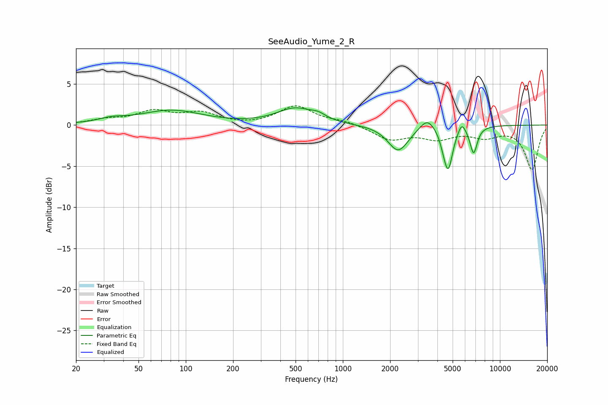

# SeeAudio_Yume_2_R
See [usage instructions](https://github.com/jaakkopasanen/AutoEq#usage) for more options and info.

### Parametric EQs
Apply preamp of -2.2 dB when using parametric equalizer.

|   # | Type    |   Fc (Hz) |    Q |   Gain (dB) |
|-----|---------|-----------|------|-------------|
|   1 | Peaking |        34 | 1.73 |         0.5 |
|   2 | Peaking |        81 | 0.71 |         1.7 |
|   3 | Peaking |       497 | 1.21 |         1.9 |
|   4 | Peaking |       698 | 3.05 |         0.5 |
|   5 | Peaking |      2252 | 2.17 |        -3.2 |
|   6 | Peaking |      3447 | 3.03 |         1.4 |
|   7 | Peaking |      4382 | 6    |        -0.9 |
|   8 | Peaking |      4694 | 4.98 |        -4.9 |
|   9 | Peaking |      5717 | 6    |         1.2 |
|  10 | Peaking |      6803 | 5.92 |        -3.3 |

### Fixed Band EQs
When using fixed band (also called graphic) equalizer, apply preamp of **-2.4 dB** (if available) and set gains manually with these parameters.

|   # | Type    |   Fc (Hz) |    Q |   Gain (dB) |
|-----|---------|-----------|------|-------------|
|   1 | Peaking |        31 | 1.41 |         0.6 |
|   2 | Peaking |        62 | 1.41 |         1.5 |
|   3 | Peaking |       125 | 1.41 |         1.3 |
|   4 | Peaking |       250 | 1.41 |        -0.1 |
|   5 | Peaking |       500 | 1.41 |         2.3 |
|   6 | Peaking |      1000 | 1.41 |         0.4 |
|   7 | Peaking |      2000 | 1.41 |        -1.7 |
|   8 | Peaking |      4000 | 1.41 |        -1.4 |
|   9 | Peaking |      8000 | 1.41 |        -1.2 |
|  10 | Peaking |     16000 | 1.41 |        -5.4 |

### Graphs

