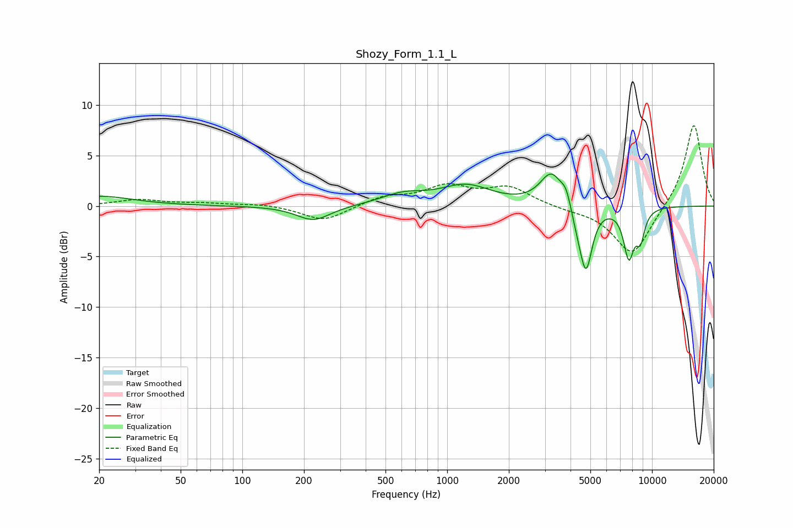

# Shozy_Form_1.1_L
See [usage instructions](https://github.com/jaakkopasanen/AutoEq#usage) for more options and info.

### Parametric EQs
Apply preamp of -3.3 dB when using parametric equalizer.

|   # | Type    |   Fc (Hz) |    Q |   Gain (dB) |
|-----|---------|-----------|------|-------------|
|   1 | Peaking |        20 | 0.88 |         1   |
|   2 | Peaking |       223 | 1.72 |        -1.5 |
|   3 | Peaking |       610 | 1.31 |         1   |
|   4 | Peaking |      1236 | 1.14 |         1.9 |
|   5 | Peaking |      3232 | 2.55 |         3.3 |
|   6 | Peaking |      3809 | 5.98 |         1.4 |
|   7 | Peaking |      4359 | 3.93 |        -1.6 |
|   8 | Peaking |      4770 | 4.64 |        -5.9 |
|   9 | Peaking |      7701 | 5.14 |        -4.7 |
|  10 | Peaking |      8773 | 6    |        -2.7 |

### Fixed Band EQs
When using fixed band (also called graphic) equalizer, apply preamp of **-8.1 dB** (if available) and set gains manually with these parameters.

|   # | Type    |   Fc (Hz) |    Q |   Gain (dB) |
|-----|---------|-----------|------|-------------|
|   1 | Peaking |        31 | 1.41 |         0.6 |
|   2 | Peaking |        62 | 1.41 |         0.2 |
|   3 | Peaking |       125 | 1.41 |         0.2 |
|   4 | Peaking |       250 | 1.41 |        -1.5 |
|   5 | Peaking |       500 | 1.41 |         0.9 |
|   6 | Peaking |      1000 | 1.41 |         1.8 |
|   7 | Peaking |      2000 | 1.41 |         1.8 |
|   8 | Peaking |      4000 | 1.41 |        -0.3 |
|   9 | Peaking |      8000 | 1.41 |        -4.9 |
|  10 | Peaking |     16000 | 1.41 |         8.2 |

### Graphs

