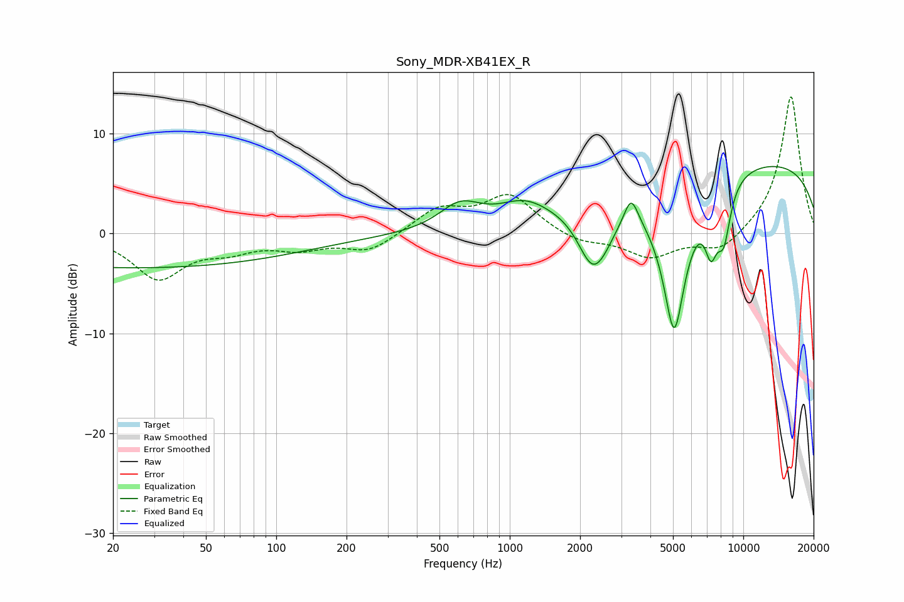

# Sony_MDR-XB41EX_R
See [usage instructions](https://github.com/jaakkopasanen/AutoEq#usage) for more options and info.

### Parametric EQs
Apply preamp of -6.8 dB when using parametric equalizer.

|   # | Type    |   Fc (Hz) |    Q |   Gain (dB) |
|-----|---------|-----------|------|-------------|
|   1 | Peaking |        25 | 0.18 |        -3.4 |
|   2 | Peaking |       613 | 1.59 |         2.5 |
|   3 | Peaking |      1149 | 1.32 |         2   |
|   4 | Peaking |      2247 | 2.24 |        -4.7 |
|   5 | Peaking |      2485 | 2.04 |        -2.3 |
|   6 | Peaking |      3308 | 4.86 |         2.7 |
|   7 | Peaking |      5059 | 2.48 |       -15.4 |
|   8 | Peaking |      7276 | 4.91 |        -4.7 |
|   9 | Peaking |      8245 | 4.38 |        -5.2 |
|  10 | Peaking |      9967 | 0.18 |         7.5 |

### Fixed Band EQs
When using fixed band (also called graphic) equalizer, apply preamp of **-13.8 dB** (if available) and set gains manually with these parameters.

|   # | Type    |   Fc (Hz) |    Q |   Gain (dB) |
|-----|---------|-----------|------|-------------|
|   1 | Peaking |        31 | 1.41 |        -4.4 |
|   2 | Peaking |        62 | 1.41 |        -1.3 |
|   3 | Peaking |       125 | 1.41 |        -1.3 |
|   4 | Peaking |       250 | 1.41 |        -1.8 |
|   5 | Peaking |       500 | 1.41 |         2.4 |
|   6 | Peaking |      1000 | 1.41 |         3.8 |
|   7 | Peaking |      2000 | 1.41 |        -1   |
|   8 | Peaking |      4000 | 1.41 |        -2.3 |
|   9 | Peaking |      8000 | 1.41 |        -1.9 |
|  10 | Peaking |     16000 | 1.41 |        13.9 |

### Graphs

