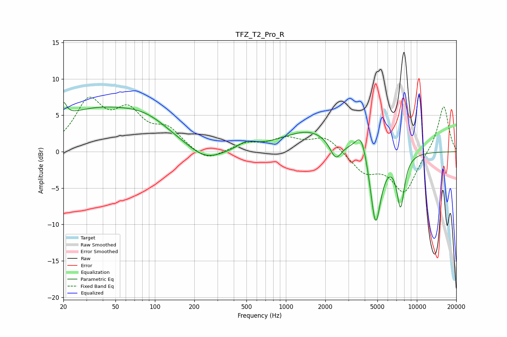

# TFZ_T2_Pro_R
See [usage instructions](https://github.com/jaakkopasanen/AutoEq#usage) for more options and info.

### Parametric EQs
Apply preamp of -6.9 dB when using parametric equalizer.

|   # | Type    |   Fc (Hz) |    Q |   Gain (dB) |
|-----|---------|-----------|------|-------------|
|   1 | Peaking |        20 | 5.96 |         2.1 |
|   2 | Peaking |        37 | 0.36 |         5.7 |
|   3 | Peaking |        89 | 0.84 |         1.6 |
|   4 | Peaking |       243 | 1.06 |        -1.9 |
|   5 | Peaking |       502 | 2.2  |         1   |
|   6 | Peaking |      1534 | 0.67 |         2.9 |
|   7 | Peaking |      2401 | 3.17 |        -2.7 |
|   8 | Peaking |      3774 | 3.13 |         3.5 |
|   9 | Peaking |      4839 | 3.31 |       -10.5 |
|  10 | Peaking |      7511 | 4.48 |        -7   |

### Fixed Band EQs
When using fixed band (also called graphic) equalizer, apply preamp of **-7.6 dB** (if available) and set gains manually with these parameters.

|   # | Type    |   Fc (Hz) |    Q |   Gain (dB) |
|-----|---------|-----------|------|-------------|
|   1 | Peaking |        31 | 1.41 |         6.5 |
|   2 | Peaking |        62 | 1.41 |         4.7 |
|   3 | Peaking |       125 | 1.41 |         2.7 |
|   4 | Peaking |       250 | 1.41 |        -1.5 |
|   5 | Peaking |       500 | 1.41 |         1.1 |
|   6 | Peaking |      1000 | 1.41 |         1.6 |
|   7 | Peaking |      2000 | 1.41 |         2.1 |
|   8 | Peaking |      4000 | 1.41 |        -2.7 |
|   9 | Peaking |      8000 | 1.41 |        -5.5 |
|  10 | Peaking |     16000 | 1.41 |         6.5 |

### Graphs

