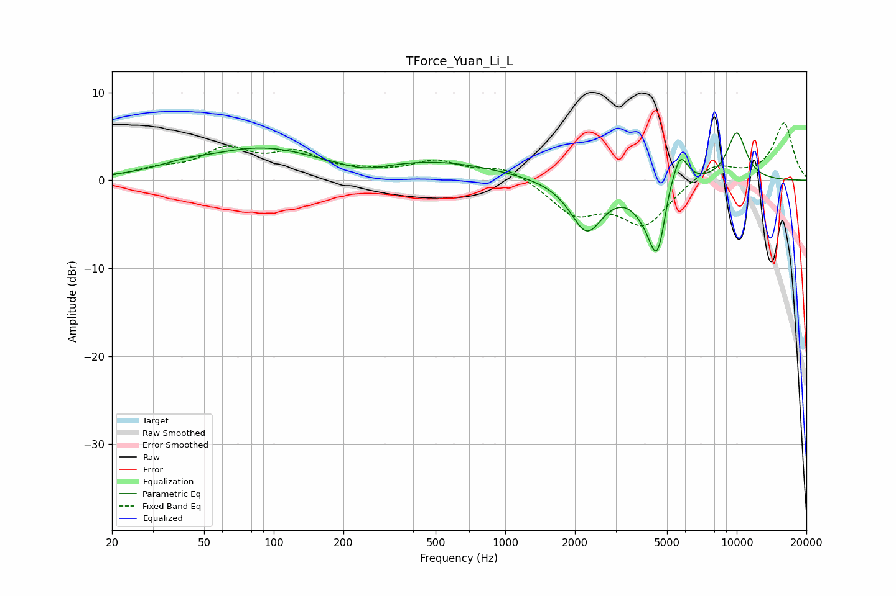

# TForce_Yuan_Li_L
See [usage instructions](https://github.com/jaakkopasanen/AutoEq#usage) for more options and info.

### Parametric EQs
Apply preamp of -5.5 dB when using parametric equalizer.

|   # | Type    |   Fc (Hz) |    Q |   Gain (dB) |
|-----|---------|-----------|------|-------------|
|   1 | Peaking |        40 | 1.2  |         0.7 |
|   2 | Peaking |        88 | 0.58 |         3.4 |
|   3 | Peaking |       245 | 1.38 |        -0.9 |
|   4 | Peaking |       510 | 0.51 |         2   |
|   5 | Peaking |      2248 | 2.01 |        -5.8 |
|   6 | Peaking |      3827 | 3.16 |        -0.7 |
|   7 | Peaking |      4533 | 3.2  |        -8.8 |
|   8 | Peaking |      5069 | 5.99 |         1.3 |
|   9 | Peaking |      5679 | 3.84 |         4.5 |
|  10 | Peaking |     10000 | 2.86 |         5.5 |

### Fixed Band EQs
When using fixed band (also called graphic) equalizer, apply preamp of **-6.6 dB** (if available) and set gains manually with these parameters.

|   # | Type    |   Fc (Hz) |    Q |   Gain (dB) |
|-----|---------|-----------|------|-------------|
|   1 | Peaking |        31 | 1.41 |         1   |
|   2 | Peaking |        62 | 1.41 |         3.2 |
|   3 | Peaking |       125 | 1.41 |         2.7 |
|   4 | Peaking |       250 | 1.41 |         0.6 |
|   5 | Peaking |       500 | 1.41 |         2   |
|   6 | Peaking |      1000 | 1.41 |         1.5 |
|   7 | Peaking |      2000 | 1.41 |        -3.6 |
|   8 | Peaking |      4000 | 1.41 |        -4.9 |
|   9 | Peaking |      8000 | 1.41 |         2   |
|  10 | Peaking |     16000 | 1.41 |         6.5 |

### Graphs

