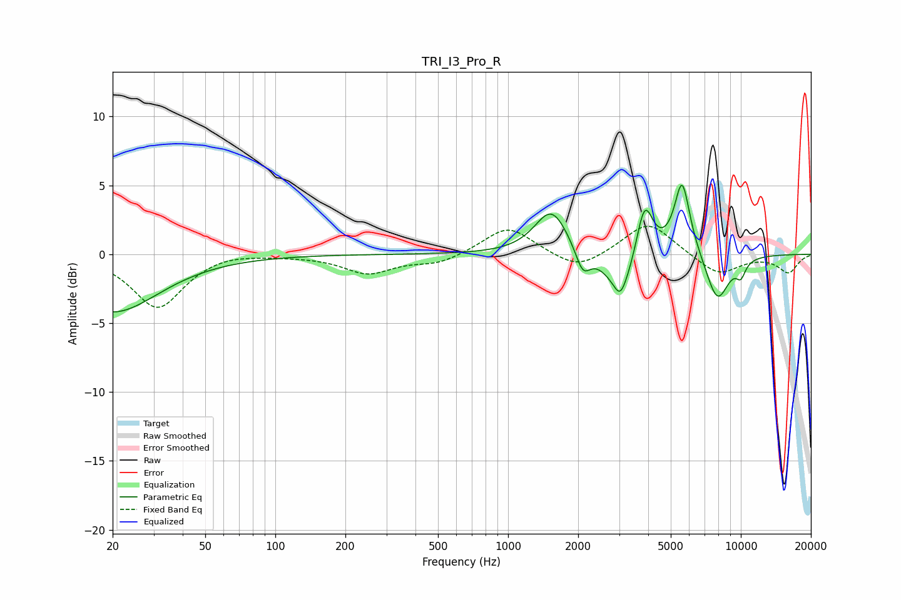

# TRI_I3_Pro_R
See [usage instructions](https://github.com/jaakkopasanen/AutoEq#usage) for more options and info.

### Parametric EQs
Apply preamp of -5.1 dB when using parametric equalizer.

|   # | Type    |   Fc (Hz) |    Q |   Gain (dB) |
|-----|---------|-----------|------|-------------|
|   1 | Peaking |        20 | 0.72 |        -4.2 |
|   2 | Peaking |      1536 | 1.99 |         3.3 |
|   3 | Peaking |      2095 | 4.54 |        -1.8 |
|   4 | Peaking |      3031 | 5.98 |        -1   |
|   5 | Peaking |      3090 | 2.06 |        -3   |
|   6 | Peaking |      3855 | 3.87 |         4.2 |
|   7 | Peaking |      5590 | 4.59 |         4.2 |
|   8 | Peaking |      5663 | 2.29 |         1.4 |
|   9 | Peaking |      7925 | 2.6  |        -3.5 |
|  10 | Peaking |     10000 | 5.93 |        -1.1 |

### Fixed Band EQs
When using fixed band (also called graphic) equalizer, apply preamp of **-2.1 dB** (if available) and set gains manually with these parameters.

|   # | Type    |   Fc (Hz) |    Q |   Gain (dB) |
|-----|---------|-----------|------|-------------|
|   1 | Peaking |        31 | 1.41 |        -3.9 |
|   2 | Peaking |        62 | 1.41 |         0.3 |
|   3 | Peaking |       125 | 1.41 |        -0   |
|   4 | Peaking |       250 | 1.41 |        -1.3 |
|   5 | Peaking |       500 | 1.41 |        -0.7 |
|   6 | Peaking |      1000 | 1.41 |         2.1 |
|   7 | Peaking |      2000 | 1.41 |        -1.3 |
|   8 | Peaking |      4000 | 1.41 |         2.4 |
|   9 | Peaking |      8000 | 1.41 |        -1.5 |
|  10 | Peaking |     16000 | 1.41 |        -1.3 |

### Graphs

