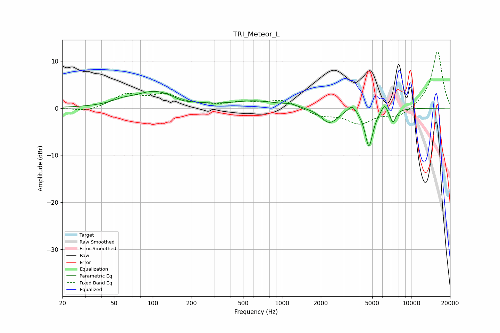

# TRI_Meteor_L
See [usage instructions](https://github.com/jaakkopasanen/AutoEq#usage) for more options and info.

### Parametric EQs
Apply preamp of -3.7 dB when using parametric equalizer.

|   # | Type    |   Fc (Hz) |    Q |   Gain (dB) |
|-----|---------|-----------|------|-------------|
|   1 | Peaking |        57 | 2    |         0.6 |
|   2 | Peaking |       104 | 0.84 |         3.5 |
|   3 | Peaking |       169 | 2.13 |        -0.6 |
|   4 | Peaking |       625 | 0.81 |         1.4 |
|   5 | Peaking |      1157 | 2.59 |         0.5 |
|   6 | Peaking |      2333 | 2.18 |        -3.2 |
|   7 | Peaking |      3491 | 4.27 |         1.7 |
|   8 | Peaking |      4715 | 4.56 |        -8.1 |
|   9 | Peaking |      6211 | 6    |         1.9 |
|  10 | Peaking |      7229 | 6    |        -2.8 |

### Fixed Band EQs
When using fixed band (also called graphic) equalizer, apply preamp of **-12.1 dB** (if available) and set gains manually with these parameters.

|   # | Type    |   Fc (Hz) |    Q |   Gain (dB) |
|-----|---------|-----------|------|-------------|
|   1 | Peaking |        31 | 1.41 |        -0.8 |
|   2 | Peaking |        62 | 1.41 |         2.8 |
|   3 | Peaking |       125 | 1.41 |         2.6 |
|   4 | Peaking |       250 | 1.41 |         0.3 |
|   5 | Peaking |       500 | 1.41 |         1.1 |
|   6 | Peaking |      1000 | 1.41 |         1.7 |
|   7 | Peaking |      2000 | 1.41 |        -1.5 |
|   8 | Peaking |      4000 | 1.41 |        -3.1 |
|   9 | Peaking |      8000 | 1.41 |        -1.9 |
|  10 | Peaking |     16000 | 1.41 |        12.2 |

### Graphs

