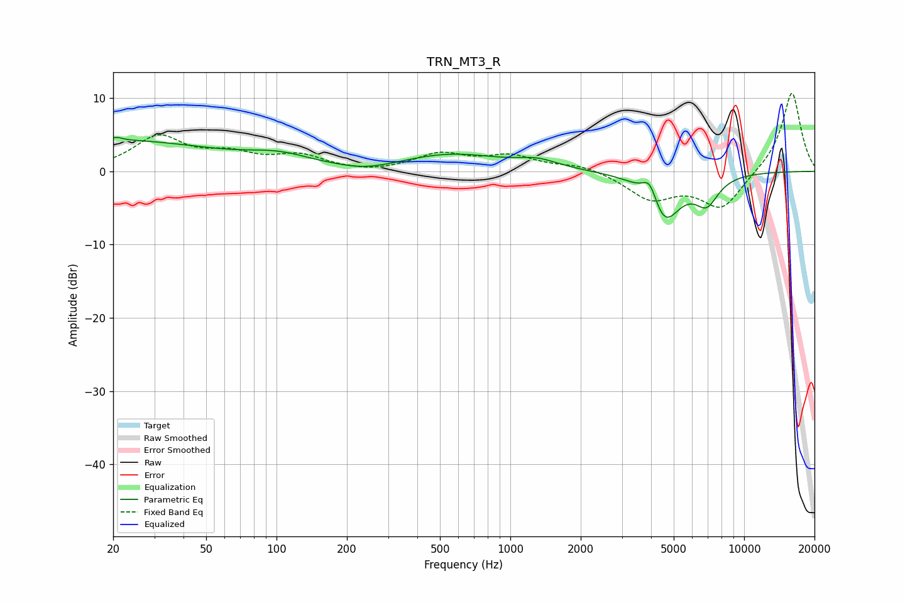

# TRN_MT3_R
See [usage instructions](https://github.com/jaakkopasanen/AutoEq#usage) for more options and info.

### Parametric EQs
Apply preamp of -4.7 dB when using parametric equalizer.

|   # | Type    |   Fc (Hz) |    Q |   Gain (dB) |
|-----|---------|-----------|------|-------------|
|   1 | Peaking |        20 | 0.32 |         4.1 |
|   2 | Peaking |        20 | 6    |        -2.8 |
|   3 | Peaking |        20 | 5.92 |         3.2 |
|   4 | Peaking |       103 | 1.03 |         1.5 |
|   5 | Peaking |       241 | 1.2  |        -0.8 |
|   6 | Peaking |       559 | 0.65 |         2.3 |
|   7 | Peaking |      1306 | 1.64 |         1.1 |
|   8 | Peaking |      3953 | 4.39 |         3.1 |
|   9 | Peaking |      4547 | 2.03 |        -6.8 |
|  10 | Peaking |      6916 | 2.69 |        -3.6 |

### Fixed Band EQs
When using fixed band (also called graphic) equalizer, apply preamp of **-10.7 dB** (if available) and set gains manually with these parameters.

|   # | Type    |   Fc (Hz) |    Q |   Gain (dB) |
|-----|---------|-----------|------|-------------|
|   1 | Peaking |        31 | 1.41 |         4.5 |
|   2 | Peaking |        62 | 1.41 |         1.9 |
|   3 | Peaking |       125 | 1.41 |         1.9 |
|   4 | Peaking |       250 | 1.41 |        -0.3 |
|   5 | Peaking |       500 | 1.41 |         2.2 |
|   6 | Peaking |      1000 | 1.41 |         1.9 |
|   7 | Peaking |      2000 | 1.41 |         0.9 |
|   8 | Peaking |      4000 | 1.41 |        -3.6 |
|   9 | Peaking |      8000 | 1.41 |        -5   |
|  10 | Peaking |     16000 | 1.41 |        11   |

### Graphs

