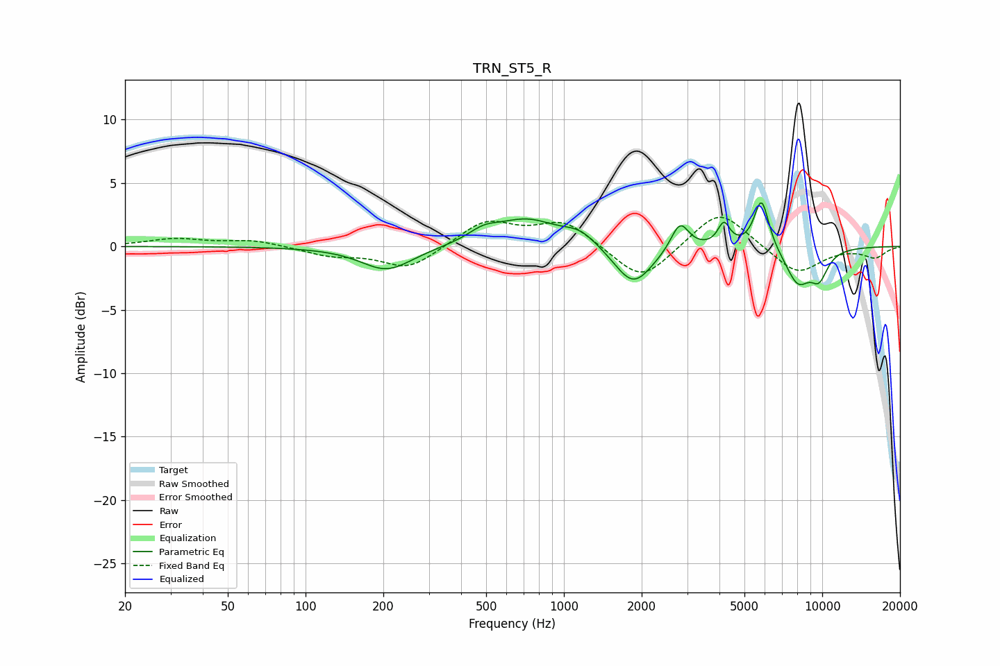

# TRN_ST5_R
See [usage instructions](https://github.com/jaakkopasanen/AutoEq#usage) for more options and info.

### Parametric EQs
Apply preamp of -3.5 dB when using parametric equalizer.

|   # | Type    |   Fc (Hz) |    Q |   Gain (dB) |
|-----|---------|-----------|------|-------------|
|   1 | Peaking |       206 | 1.41 |        -1.9 |
|   2 | Peaking |       489 | 2.3  |         0.8 |
|   3 | Peaking |       718 | 1.2  |         2   |
|   4 | Peaking |      1156 | 2.07 |         1   |
|   5 | Peaking |      1856 | 1.91 |        -3.2 |
|   6 | Peaking |      2813 | 4.06 |         2.3 |
|   7 | Peaking |      4162 | 6    |         1.8 |
|   8 | Peaking |      5822 | 4.75 |         4   |
|   9 | Peaking |      8046 | 2.66 |        -2.8 |
|  10 | Peaking |      9722 | 3.58 |        -2   |

### Fixed Band EQs
When using fixed band (also called graphic) equalizer, apply preamp of **-2.4 dB** (if available) and set gains manually with these parameters.

|   # | Type    |   Fc (Hz) |    Q |   Gain (dB) |
|-----|---------|-----------|------|-------------|
|   1 | Peaking |        31 | 1.41 |         0.6 |
|   2 | Peaking |        62 | 1.41 |         0.5 |
|   3 | Peaking |       125 | 1.41 |        -0.7 |
|   4 | Peaking |       250 | 1.41 |        -1.8 |
|   5 | Peaking |       500 | 1.41 |         2   |
|   6 | Peaking |      1000 | 1.41 |         2   |
|   7 | Peaking |      2000 | 1.41 |        -2.9 |
|   8 | Peaking |      4000 | 1.41 |         3   |
|   9 | Peaking |      8000 | 1.41 |        -2.2 |
|  10 | Peaking |     16000 | 1.41 |        -0.8 |

### Graphs

