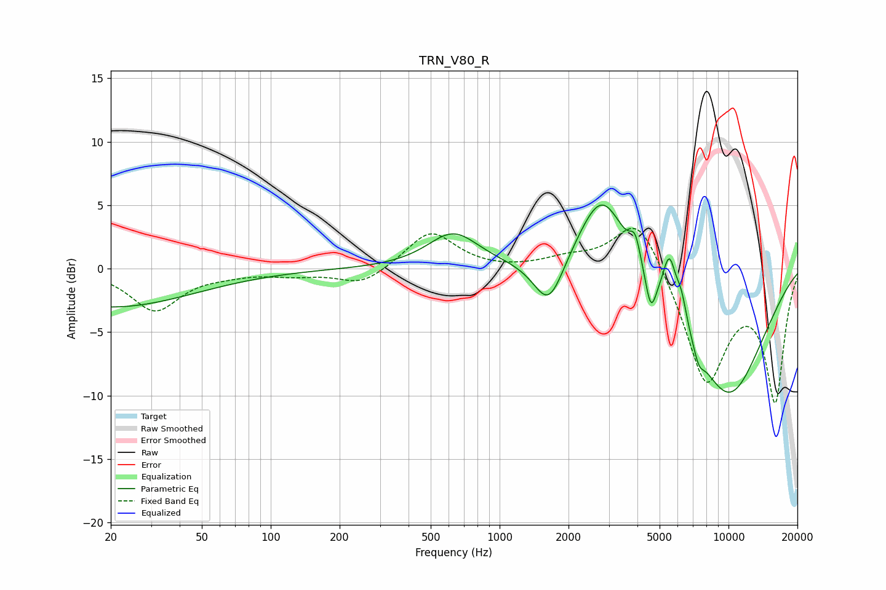

# TRN_V80_R
See [usage instructions](https://github.com/jaakkopasanen/AutoEq#usage) for more options and info.

### Parametric EQs
Apply preamp of -5.1 dB when using parametric equalizer.

|   # | Type    |   Fc (Hz) |    Q |   Gain (dB) |
|-----|---------|-----------|------|-------------|
|   1 | Peaking |        20 | 0.39 |        -3   |
|   2 | Peaking |       627 | 1.27 |         2.8 |
|   3 | Peaking |      1642 | 2.12 |        -4   |
|   4 | Peaking |      2806 | 1.31 |         6.8 |
|   5 | Peaking |      3917 | 5.97 |         2   |
|   6 | Peaking |      4581 | 6    |        -2.8 |
|   7 | Peaking |      5519 | 4.8  |         4   |
|   8 | Peaking |      6222 | 5.71 |         1.9 |
|   9 | Peaking |      7415 | 5.95 |        -1.1 |
|  10 | Peaking |      9945 | 0.67 |       -10   |

### Fixed Band EQs
When using fixed band (also called graphic) equalizer, apply preamp of **-3.3 dB** (if available) and set gains manually with these parameters.

|   # | Type    |   Fc (Hz) |    Q |   Gain (dB) |
|-----|---------|-----------|------|-------------|
|   1 | Peaking |        31 | 1.41 |        -3.3 |
|   2 | Peaking |        62 | 1.41 |        -0.3 |
|   3 | Peaking |       125 | 1.41 |        -0.4 |
|   4 | Peaking |       250 | 1.41 |        -1.3 |
|   5 | Peaking |       500 | 1.41 |         3   |
|   6 | Peaking |      1000 | 1.41 |        -0.1 |
|   7 | Peaking |      2000 | 1.41 |         0.7 |
|   8 | Peaking |      4000 | 1.41 |         4.5 |
|   9 | Peaking |      8000 | 1.41 |        -9   |
|  10 | Peaking |     16000 | 1.41 |       -10.2 |

### Graphs

