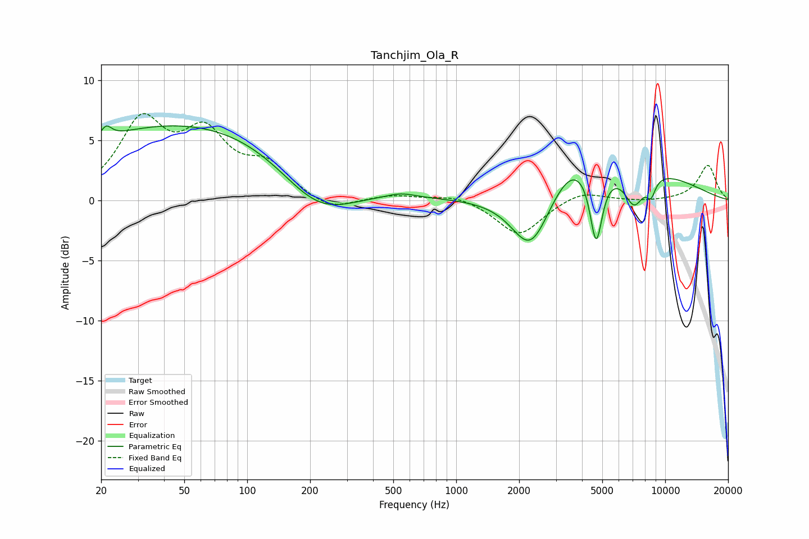

# Tanchjim_Ola_R
See [usage instructions](https://github.com/jaakkopasanen/AutoEq#usage) for more options and info.

### Parametric EQs
Apply preamp of -6.3 dB when using parametric equalizer.

|   # | Type    |   Fc (Hz) |    Q |   Gain (dB) |
|-----|---------|-----------|------|-------------|
|   1 | Peaking |        21 | 5.42 |         1   |
|   2 | Peaking |        61 | 0.2  |         6.7 |
|   3 | Peaking |       218 | 0.72 |        -4.7 |
|   4 | Peaking |       546 | 2.22 |         0.4 |
|   5 | Peaking |      2275 | 1.54 |        -5   |
|   6 | Peaking |      3590 | 1.32 |         2.3 |
|   7 | Peaking |      4673 | 4.75 |        -6   |
|   8 | Peaking |      7017 | 0.46 |         2.8 |
|   9 | Peaking |      7106 | 2.85 |        -2.9 |
|  10 | Peaking |      8551 | 5.87 |        -1.4 |

### Fixed Band EQs
When using fixed band (also called graphic) equalizer, apply preamp of **-7.3 dB** (if available) and set gains manually with these parameters.

|   # | Type    |   Fc (Hz) |    Q |   Gain (dB) |
|-----|---------|-----------|------|-------------|
|   1 | Peaking |        31 | 1.41 |         6.2 |
|   2 | Peaking |        62 | 1.41 |         4.9 |
|   3 | Peaking |       125 | 1.41 |         2.6 |
|   4 | Peaking |       250 | 1.41 |        -1   |
|   5 | Peaking |       500 | 1.41 |         0.4 |
|   6 | Peaking |      1000 | 1.41 |         0.5 |
|   7 | Peaking |      2000 | 1.41 |        -2.9 |
|   8 | Peaking |      4000 | 1.41 |         0.9 |
|   9 | Peaking |      8000 | 1.41 |        -0.1 |
|  10 | Peaking |     16000 | 1.41 |         2.9 |

### Graphs

