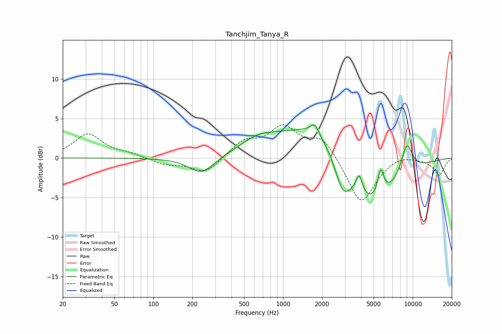

# Tanchjim_Tanya_R
See [usage instructions](https://github.com/jaakkopasanen/AutoEq#usage) for more options and info.

### Parametric EQs
Apply preamp of -4.3 dB when using parametric equalizer.

|   # | Type    |   Fc (Hz) |    Q |   Gain (dB) |
|-----|---------|-----------|------|-------------|
|   1 | Peaking |       235 | 1.46 |        -2.2 |
|   2 | Peaking |       602 | 1.23 |         0.7 |
|   3 | Peaking |       761 | 0.75 |         1.8 |
|   4 | Peaking |      1755 | 4.8  |         1.2 |
|   5 | Peaking |      1867 | 0.71 |         4.6 |
|   6 | Peaking |      2870 | 2.49 |        -3.4 |
|   7 | Peaking |      3859 | 5.54 |         2.5 |
|   8 | Peaking |      4658 | 0.69 |        -6.6 |
|   9 | Peaking |      5667 | 5.77 |         3.3 |
|  10 | Peaking |      9004 | 2.85 |         4   |

### Fixed Band EQs
When using fixed band (also called graphic) equalizer, apply preamp of **-4.3 dB** (if available) and set gains manually with these parameters.

|   # | Type    |   Fc (Hz) |    Q |   Gain (dB) |
|-----|---------|-----------|------|-------------|
|   1 | Peaking |        31 | 1.41 |         3   |
|   2 | Peaking |        62 | 1.41 |         0.5 |
|   3 | Peaking |       125 | 1.41 |        -0.8 |
|   4 | Peaking |       250 | 1.41 |        -2   |
|   5 | Peaking |       500 | 1.41 |         2   |
|   6 | Peaking |      1000 | 1.41 |         3.7 |
|   7 | Peaking |      2000 | 1.41 |         2.6 |
|   8 | Peaking |      4000 | 1.41 |        -5.9 |
|   9 | Peaking |      8000 | 1.41 |         0.6 |
|  10 | Peaking |     16000 | 1.41 |        -2.2 |

### Graphs

